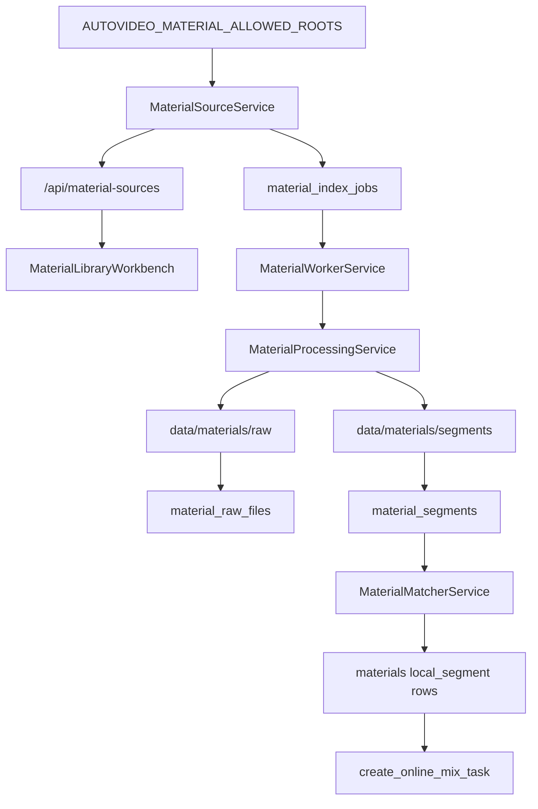

# Local Material Worker Implementation Plan

> **For agentic workers:** REQUIRED SUB-SKILL: Use superpowers:subagent-driven-development (recommended) or superpowers:executing-plans to implement this plan task-by-task. Steps use checkbox (`- [ ]`) syntax for tracking.

**Goal:** 实现 AutoVideo 的本地目录素材库、后台索引 worker、素材切片管理页，并让混剪任务可用本地切片生成现有 `material_id`。

**Architecture:** 后端新增目录白名单解析、SQLite 索引表、持久 job 队列、扫描/复制/切片处理和 matcher；旧 `/api/materials` 上传语义保留，新目录素材 API 使用 `/api/material-sources` 与 `/api/material-index`。前端新增素材库工作台，并在混剪工作台加入 `local`、`hybrid`、`online_free` 素材来源模式。第一阶段只实现基础扫描、复制、切片和基础匹配，AI 标注/向量字段保留为 `not_configured` 或 `skipped`。

**Tech Stack:** Python 3.12, FastAPI, SQLite, pytest, FFmpeg/ffprobe subprocess calls, React, TypeScript, TanStack Query, Vitest, Testing Library, Lucide, CSS.

## Global Constraints

- Branch: work on `codex/material-library-feature`; do not develop on `main`.
- Reference spec: `docs/superpowers/specs/2026-06-24-local-material-worker-design.md`.
- Do not implement upload as the new material library primary flow; existing `/api/materials` remains compatible.
- External source directories are read-only; delete and clear operations only touch AutoVideo managed data files.
- Path validation must use `Path.resolve(strict=True)` and `relative_to`, not string prefix checks.
- API responses, frontend state, manifest, errors, README and `.env.example` must not expose external absolute paths, managed data absolute paths, token, model paths, or `.env` real values.
- Active material index jobs are unique by normalized directory identity: `(allowed_root_id, source_path_hash)` or equivalent `(allowed_root_id, normalized source_relative_path)`, not by `source_config_id`.
- First-stage job state is persistent in SQLite; in-memory locks are only an optimization.
- First-stage model statuses are `not_configured` or `skipped`; do not add model dependencies or model weights.
- UI must be mobile-first, keyboard operable, non-hover dependent, and use 44px minimum touch targets for key actions.
- Use Lucide icons for buttons where an icon exists.
- Help surface for this round is `README.md` and `.env.example`.

---

## System Flow



## File Structure

- Modify: `autovideo/core/settings.py`
  - Add `material_allowed_roots` setting mapped from `AUTOVIDEO_MATERIAL_ALLOWED_ROOTS`.
- Modify: `autovideo/core/paths.py`
  - Add managed raw and segment directories under `AUTOVIDEO_DATA_DIR/materials`.
- Modify: `autovideo/storage/database.py`
  - Add schema and helpers for `material_source_configs`, `material_index_jobs`, `material_raw_files`, and `material_segments`.
- Create: `autovideo/services/material_sources.py`
  - Parse allowed roots, validate submitted relative paths, save and expose current source config.
- Create: `autovideo/services/material_processing.py`
  - Scan videos, copy raw files, probe metadata, slice with FFmpeg, and guard symlink/path escapes.
- Create: `autovideo/services/material_worker.py`
  - Create, claim, run, heartbeat, stale, and summarize material index jobs.
- Create: `autovideo/services/material_matcher.py`
  - Select ready local segments for script shots and create/reuse `materials` compatibility rows.
- Create: `autovideo/api/routes/material_sources.py`
  - Implement `/api/material-sources` endpoints.
- Create: `autovideo/api/routes/material_index.py`
  - Implement `/api/material-index` endpoints.
- Modify: `autovideo/api/app.py`
  - Register material source/index routers.
- Modify: `autovideo/api/routes/online_mix.py`
  - Add `material_source_mode` request field and local material error mapping.
- Modify: `autovideo/services/online_mix.py`
  - Call matcher before online fallback and include local segment metadata in manifest shots.
- Create: `tests/services/test_material_sources.py`
  - Source root parsing, path resolve, symlink and redaction tests.
- Create: `tests/services/test_material_worker_jobs.py`
  - Persistent queue, active job uniqueness, heartbeat and stale job tests.
- Create: `tests/services/test_material_processing.py`
  - Scan/copy/probe/slice and managed delete safety tests.
- Create: `tests/services/test_material_matcher.py`
  - Segment selection and `materials/material_id` compatibility tests.
- Create: `tests/api/test_material_sources.py`
  - `/api/material-sources` API tests.
- Create: `tests/api/test_material_index.py`
  - `/api/material-index` summary/list/delete/clear API tests.
- Create: `tests/api/test_material_worker_execution.py`
  - API background execution tests that prove queued jobs are claimed and processed.
- Modify: `tests/api/test_online_mix.py`
  - Local and hybrid material source mode tests.
- Create: `frontend/src/api/materials.ts`
  - Material source/index API client, DTO types, readable error mapping.
- Create: `frontend/src/components/MaterialLibraryWorkbench.tsx`
  - Directory config, job status, stats, raw list, expandable rows, destructive actions.
- Modify: `frontend/src/App.tsx`
  - Enable `materials` navigation and render the workbench.
- Modify: `frontend/src/components/OnlineRemixWorkbench.tsx`
  - Add material source mode control and submit `material_source_mode`.
- Modify: `frontend/src/api/onlineRemix.ts`
  - Add material source mode type and response metadata types.
- Modify: `frontend/src/App.test.tsx`
  - Frontend navigation, material workbench, mobile/a11y, and online remix mode tests.
- Modify: `frontend/src/styles.css`
  - Material workbench responsive layout, touch targets, focus and overflow rules.
- Modify: `tests/web/test_frontend_build.py`
  - Static checks for material navigation, docs and CSS constraints.
- Create: `tests/web/test_material_workbench_mobile.py`
  - Real-browser mobile viewport checks for `#materials` after the frontend build.
- Modify: `pyproject.toml`
  - Add Python Playwright to dev dependencies for the real-browser mobile test.
- Modify: `README.md`
  - Add env format, safety semantics, APIs, material source modes and operational notes.
- Modify: `.env.example`
  - Add commented safe example for `AUTOVIDEO_MATERIAL_ALLOWED_ROOTS`.

---

## Cross-Task Interfaces

```python
# autovideo/services/material_sources.py
@dataclass(frozen=True)
class AllowedMaterialRoot:
    id: str
    alias: str
    display_name: str
    resolved_path: Path

@dataclass(frozen=True)
class ResolvedMaterialSource:
    allowed_root: AllowedMaterialRoot
    source_relative_path: str
    source_display_path: str
    source_path_hash: str
    resolved_path: Path

class MaterialSourceService:
    def allowed_roots(self) -> list[AllowedMaterialRoot]:
        raise NotImplementedError

    def resolve_source(self, allowed_root_id: str, source_relative_path: str) -> ResolvedMaterialSource:
        raise NotImplementedError

    def save_current_source(self, allowed_root_id: str, source_relative_path: str) -> dict[str, Any]:
        raise NotImplementedError

    def status(self) -> dict[str, Any]:
        raise NotImplementedError
```

```python
# autovideo/services/material_worker.py
class MaterialWorkerService:
    def create_index_job(self, source_config_id: str, *, force: bool = False) -> dict[str, Any]:
        raise NotImplementedError

    def claim_next_job(self) -> dict[str, Any] | None:
        raise NotImplementedError

    def claim_job(self, job_id: str) -> dict[str, Any] | None:
        raise NotImplementedError

    def run_job(self, job_id: str) -> dict[str, Any]:
        raise NotImplementedError

    def mark_stale_jobs(self) -> int:
        raise NotImplementedError

    def latest_job(self, source_config_id: str | None = None) -> dict[str, Any] | None:
        raise NotImplementedError
```

```python
# autovideo/services/material_matcher.py
MaterialSourceMode = Literal["local", "hybrid", "online_free"]

class MaterialLibraryEmptyError(Exception):
    pass


class MaterialLibraryNotReadyError(Exception):
    def __init__(self, job: dict[str, Any]) -> None:
        self.job = job
        super().__init__("MATERIAL_LIBRARY_NOT_READY")

class MaterialMatcherService:
    def prepare_for_script(
        self,
        script: dict[str, Any],
        mode: MaterialSourceMode,
        only_shot_indexes: set[int] | None = None,
    ) -> list[dict[str, Any]]:
        raise NotImplementedError
```

```ts
// frontend/src/api/materials.ts
export interface MaterialSourceStatus {
  allowed_roots: MaterialAllowedRoot[];
  current_source: MaterialSourceConfig | null;
  latest_job: MaterialIndexJob | null;
}

export interface MaterialRawFile {
  id: string;
  filename: string;
  source_display_path: string;
  size_bytes: number;
  duration_seconds: number | null;
  orientation: "portrait" | "landscape" | "square" | "unknown";
  segments: number;
  status: string;
  error_summary?: string | null;
}
```

---

### Task 1: Material Source Settings, Paths, And Schema

**Files:**
- Create: `tests/services/test_material_sources.py`
- Modify: `autovideo/core/settings.py`
- Modify: `autovideo/core/paths.py`
- Modify: `autovideo/storage/database.py`
- Create: `autovideo/services/material_sources.py`

**Interfaces:**
- Produces `MaterialSourceService.allowed_roots()`, `resolve_source()`, `save_current_source()`, and `status()`.
- Produces database helpers used by worker/API tasks:
  - `insert_material_source_config(config: dict[str, Any]) -> dict[str, Any]`
  - `get_material_source_config(config_id: str) -> dict[str, Any] | None`
  - `current_material_source_config() -> dict[str, Any] | None`

- [ ] **Step 1: Write failing source tests**

Create `tests/services/test_material_sources.py` with these tests:

```python
from pathlib import Path

import pytest

from autovideo.core.settings import Settings
from autovideo.services.material_sources import (
    MaterialSourcePathOutOfScopeError,
    MaterialSourceRootNotConfiguredError,
    MaterialSourceNotFoundError,
    MaterialSourceService,
)
from autovideo.storage.database import AutoVideoStore


def _service(tmp_path: Path, roots: str | None) -> MaterialSourceService:
    settings = Settings(_env_file=None, data_dir=tmp_path / "data", material_allowed_roots=roots)
    return MaterialSourceService(AutoVideoStore(settings))


def test_allowed_roots_redacts_absolute_paths(tmp_path: Path) -> None:
    root = tmp_path / "source"
    root.mkdir()
    service = _service(tmp_path, f"demo={root}")

    payload = service.status()

    assert payload["allowed_roots"] == [
        {"id": "demo", "alias": "demo", "display_name": "demo"}
    ]
    assert str(root) not in str(payload)


def test_resolve_source_rejects_missing_roots(tmp_path: Path) -> None:
    service = _service(tmp_path, None)

    with pytest.raises(MaterialSourceRootNotConfiguredError):
        service.allowed_roots()


def test_resolve_source_rejects_path_escape_and_absolute_input(tmp_path: Path) -> None:
    root = tmp_path / "source"
    outside = tmp_path / "outside"
    root.mkdir()
    outside.mkdir()
    service = _service(tmp_path, f"demo={root}")

    with pytest.raises(MaterialSourcePathOutOfScopeError):
        service.resolve_source("demo", "../outside")

    with pytest.raises(MaterialSourcePathOutOfScopeError):
        service.resolve_source("demo", str(outside))


def test_resolve_source_rejects_symlink_escape(tmp_path: Path) -> None:
    root = tmp_path / "source"
    outside = tmp_path / "outside"
    root.mkdir()
    outside.mkdir()
    (root / "escape").symlink_to(outside, target_is_directory=True)
    service = _service(tmp_path, f"demo={root}")

    with pytest.raises(MaterialSourcePathOutOfScopeError):
        service.resolve_source("demo", "escape")


def test_save_current_source_stores_relative_identity_only(tmp_path: Path) -> None:
    root = tmp_path / "source"
    child = root / "clips"
    child.mkdir(parents=True)
    service = _service(tmp_path, f"demo={root}")

    config = service.save_current_source("demo", "clips")

    assert config["allowed_root_id"] == "demo"
    assert config["source_relative_path"] == "clips"
    assert config["source_display_path"] == "demo/clips"
    assert str(root) not in str(config)
    assert len(config["source_path_hash"]) == 64


def test_resolve_source_rejects_missing_child(tmp_path: Path) -> None:
    root = tmp_path / "source"
    root.mkdir()
    service = _service(tmp_path, f"demo={root}")

    with pytest.raises(MaterialSourceNotFoundError):
        service.resolve_source("demo", "missing")
```

- [ ] **Step 2: Run source tests and verify failure**

Run: `pytest tests/services/test_material_sources.py -q`

Expected: FAIL with import errors for `autovideo.services.material_sources`.

- [ ] **Step 3: Add settings and data paths**

Modify `autovideo/core/settings.py`:

```python
material_allowed_roots: str | None = None
```

Add `material_allowed_roots` to the `empty_string_is_disabled` validator field list.

Modify `autovideo/core/paths.py`:

```python
@dataclass(frozen=True)
class DataPaths:
    root: Path
    materials: Path
    material_raw: Path
    material_segments: Path
    bgm: Path
    voices: Path
    subtitle_templates: Path
    outputs: Path
    tasks: Path
```

Set `material_raw=root / "materials" / "raw"` and `material_segments=root / "materials" / "segments"` in `build_data_paths()`, and include both in `ensure_data_dirs()`.

- [ ] **Step 4: Add SQLite schema and source helpers**

Modify `AutoVideoStore._ensure_schema()` to create:

```sql
CREATE TABLE IF NOT EXISTS material_source_configs (
    id TEXT PRIMARY KEY,
    allowed_root_id TEXT NOT NULL,
    allowed_root_alias TEXT NOT NULL,
    source_relative_path TEXT NOT NULL,
    source_display_path TEXT NOT NULL,
    source_path_hash TEXT NOT NULL,
    status TEXT NOT NULL,
    error_summary TEXT,
    created_at TEXT NOT NULL,
    updated_at TEXT NOT NULL
)
```

Add store methods:

```python
def insert_material_source_config(self, config: dict[str, Any]) -> dict[str, Any]:
    raise NotImplementedError

def get_material_source_config(self, config_id: str) -> dict[str, Any] | None:
    raise NotImplementedError

def current_material_source_config(self) -> dict[str, Any] | None:
    raise NotImplementedError
```

Exact behavior:

- `insert_material_source_config()` runs in one SQLite transaction.
- Before inserting a new `status='active'` config, set older active configs to `status='inactive'` and `updated_at=<now>`.
- Return `_material_source_config_from_row()` with only DB fields; never include a resolved absolute path.
- `current_material_source_config()` returns the newest `status='active'` config by `updated_at DESC, rowid DESC`.

- [ ] **Step 5: Implement material source service**

Create `autovideo/services/material_sources.py` with:

```python
from __future__ import annotations

import hashlib
import re
import uuid
from dataclasses import dataclass
from datetime import UTC, datetime
from pathlib import Path
from typing import Any

from autovideo.storage.database import AutoVideoStore

ROOT_ID_RE = re.compile(r"^[A-Za-z0-9_-]{1,40}$")


class MaterialSourceRootNotConfiguredError(Exception):
    pass


class MaterialSourceRootNotFoundError(Exception):
    pass


class MaterialSourceNotFoundError(Exception):
    pass


class MaterialSourcePathOutOfScopeError(Exception):
    pass


@dataclass(frozen=True)
class AllowedMaterialRoot:
    id: str
    alias: str
    display_name: str
    resolved_path: Path


@dataclass(frozen=True)
class ResolvedMaterialSource:
    allowed_root: AllowedMaterialRoot
    source_relative_path: str
    source_display_path: str
    source_path_hash: str
    resolved_path: Path
```

Parsing rules:

```python
def _parse_allowed_roots(raw: str | None) -> list[AllowedMaterialRoot]:
    # raw format: "demo=/path/to/root;shared=/another/root"
    # skip missing or unreadable roots
    # reject invalid root ids
```

Containment rules:

```python
def _relative_to_root(path: Path, root: Path) -> str:
    try:
        relative = path.relative_to(root)
    except ValueError as exc:
        raise MaterialSourcePathOutOfScopeError() from exc
    return "." if str(relative) == "." else relative.as_posix()
```

Public DTOs must omit `resolved_path`.

- [ ] **Step 6: Run source tests and focused core tests**

Run:

```bash
pytest tests/services/test_material_sources.py tests/core/test_paths.py tests/core/test_settings.py -q
```

Expected: PASS.

- [ ] **Step 7: Commit task 1**

Run:

```bash
git add autovideo/core/settings.py autovideo/core/paths.py autovideo/storage/database.py autovideo/services/material_sources.py tests/services/test_material_sources.py
git commit -m "feat: add material source configuration"
```

---

### Task 2: Persistent Material Index Jobs

**Files:**
- Create: `tests/services/test_material_worker_jobs.py`
- Modify: `autovideo/storage/database.py`
- Create: `autovideo/services/material_worker.py`

**Interfaces:**
- Consumes `material_source_configs`.
- Produces job lifecycle helpers and `MaterialWorkerService.create_index_job()`, `claim_next_job()`, `mark_stale_jobs()`, `latest_job()`.

- [ ] **Step 1: Write failing worker job tests**

Create `tests/services/test_material_worker_jobs.py`:

```python
import sqlite3
from datetime import UTC, datetime, timedelta
from pathlib import Path

import pytest

from autovideo.core.settings import Settings
from autovideo.services.material_sources import MaterialSourceService
from autovideo.services.material_worker import (
    MaterialIndexAlreadyRunningError,
    MaterialWorkerService,
)
from autovideo.storage.database import AutoVideoStore


def _store_and_source(tmp_path: Path):
    root = tmp_path / "source"
    (root / "clips").mkdir(parents=True)
    settings = Settings(_env_file=None, data_dir=tmp_path / "data", material_allowed_roots=f"demo={root}")
    store = AutoVideoStore(settings)
    source = MaterialSourceService(store).save_current_source("demo", "clips")
    return store, source


def test_create_job_rejects_active_job_for_same_directory(tmp_path: Path) -> None:
    store, source = _store_and_source(tmp_path)
    service = MaterialWorkerService(store)
    first = service.create_index_job(source["id"])

    with pytest.raises(MaterialIndexAlreadyRunningError):
        service.create_index_job(source["id"], force=True)

    assert first["status"] == "queued"


def test_create_job_uses_directory_identity_not_source_config_id(tmp_path: Path) -> None:
    store, source = _store_and_source(tmp_path)
    duplicate = dict(source)
    duplicate["id"] = "duplicate-config"
    store.insert_material_source_config(duplicate)
    service = MaterialWorkerService(store)
    service.create_index_job(source["id"])

    with pytest.raises(MaterialIndexAlreadyRunningError):
        service.create_index_job("duplicate-config")


def test_active_job_unique_index_rejects_direct_duplicate_insert(tmp_path: Path) -> None:
    store, source = _store_and_source(tmp_path)
    service = MaterialWorkerService(store)
    first = service.create_index_job(source["id"])

    with pytest.raises(sqlite3.IntegrityError):
        with store.connect() as connection:
            connection.execute(
                """
                INSERT INTO material_index_jobs (
                    id, source_config_id, allowed_root_id, source_relative_path,
                    source_path_hash, status, stage, created_at
                )
                VALUES (?, ?, ?, ?, ?, ?, ?, ?)
                """,
                (
                    "duplicate-active-job",
                    source["id"],
                    source["allowed_root_id"],
                    source["source_relative_path"],
                    source["source_path_hash"],
                    "queued",
                    "scanning",
                    first["created_at"],
                ),
            )


def test_second_connection_cannot_create_active_job_while_running(tmp_path: Path) -> None:
    root = tmp_path / "source"
    (root / "clips").mkdir(parents=True)
    settings = Settings(
        _env_file=None,
        data_dir=tmp_path / "data",
        material_allowed_roots=f"demo={root}",
    )
    store_one = AutoVideoStore(settings)
    source = MaterialSourceService(store_one).save_current_source("demo", "clips")
    service_one = MaterialWorkerService(store_one)
    created = service_one.create_index_job(source["id"])

    claimed = service_one.claim_next_job()

    assert claimed is not None
    assert claimed["id"] == created["id"]
    assert claimed["status"] == "running"
    store_two = AutoVideoStore(settings)
    service_two = MaterialWorkerService(store_two)
    with pytest.raises(MaterialIndexAlreadyRunningError):
        service_two.create_index_job(source["id"], force=True)
    with pytest.raises(sqlite3.IntegrityError):
        with store_two.connect() as connection:
            connection.execute(
                """
                INSERT INTO material_index_jobs (
                    id, source_config_id, allowed_root_id, source_relative_path,
                    source_path_hash, status, stage, created_at
                )
                VALUES (?, ?, ?, ?, ?, ?, ?, ?)
                """,
                (
                    "second-connection-active-job",
                    source["id"],
                    source["allowed_root_id"],
                    source["source_relative_path"],
                    source["source_path_hash"],
                    "queued",
                    "scanning",
                    created["created_at"],
                ),
            )


def test_claim_next_job_marks_running_and_heartbeat(tmp_path: Path) -> None:
    store, source = _store_and_source(tmp_path)
    service = MaterialWorkerService(store)
    created = service.create_index_job(source["id"])

    claimed = service.claim_next_job()

    assert claimed is not None
    assert claimed["id"] == created["id"]
    assert claimed["status"] == "running"
    assert claimed["attempt_count"] == 1
    assert claimed["started_at"]
    assert claimed["heartbeat_at"]


def test_mark_stale_jobs_closes_old_running_jobs(tmp_path: Path) -> None:
    store, source = _store_and_source(tmp_path)
    service = MaterialWorkerService(store)
    created = service.create_index_job(source["id"])
    claimed = service.claim_next_job()
    old = datetime.now(UTC) - timedelta(hours=2)
    store.update_material_index_job(
        claimed["id"],
        {"heartbeat_at": old.isoformat()},
    )

    count = service.mark_stale_jobs(stale_after_seconds=60)
    job = store.get_material_index_job(created["id"])

    assert count == 1
    assert job["status"] == "stale"
```

- [ ] **Step 2: Run worker tests and verify failure**

Run: `pytest tests/services/test_material_worker_jobs.py -q`

Expected: FAIL with import errors or missing store methods.

- [ ] **Step 3: Add job schema**

Modify `AutoVideoStore._ensure_schema()` to create `material_index_jobs`:

```sql
CREATE TABLE IF NOT EXISTS material_index_jobs (
    id TEXT PRIMARY KEY,
    source_config_id TEXT NOT NULL,
    allowed_root_id TEXT NOT NULL,
    source_relative_path TEXT NOT NULL,
    source_path_hash TEXT NOT NULL,
    status TEXT NOT NULL,
    stage TEXT NOT NULL,
    progress_current INTEGER NOT NULL DEFAULT 0,
    progress_total INTEGER NOT NULL DEFAULT 0,
    raw_files_total INTEGER NOT NULL DEFAULT 0,
    segments_total INTEGER NOT NULL DEFAULT 0,
    failed_total INTEGER NOT NULL DEFAULT 0,
    heartbeat_at TEXT,
    attempt_count INTEGER NOT NULL DEFAULT 0,
    error_summary TEXT,
    created_at TEXT NOT NULL,
    started_at TEXT,
    finished_at TEXT
);

CREATE UNIQUE INDEX IF NOT EXISTS idx_material_index_jobs_active_source
ON material_index_jobs (allowed_root_id, source_path_hash)
WHERE status IN ('queued', 'running');
```

Add store methods:

```python
def insert_material_index_job(self, job: dict[str, Any]) -> dict[str, Any]:
    raise NotImplementedError

def get_material_index_job(self, job_id: str) -> dict[str, Any] | None:
    raise NotImplementedError

def update_material_index_job(self, job_id: str, patch: dict[str, Any]) -> dict[str, Any]:
    raise NotImplementedError

def latest_material_index_job(self, source_config_id: str | None = None) -> dict[str, Any] | None:
    raise NotImplementedError

def active_material_index_job(self, allowed_root_id: str, source_path_hash: str) -> dict[str, Any] | None:
    raise NotImplementedError

def claim_next_material_index_job(self, now: str) -> dict[str, Any] | None:
    raise NotImplementedError

def claim_material_index_job(self, job_id: str, now: str) -> dict[str, Any] | None:
    raise NotImplementedError

def mark_stale_material_index_jobs(self, stale_before: str, now: str) -> int:
    raise NotImplementedError
```

Exact behavior:

- `insert_material_index_job(job)` runs `BEGIN IMMEDIATE`, checks for an active job with the same `(allowed_root_id, source_path_hash)` inside the transaction, inserts the queued job, and commits. If the active unique index raises `sqlite3.IntegrityError`, convert it to `MaterialIndexAlreadyRunningError`.
- `active_material_index_job()` uses `WHERE allowed_root_id = ? AND source_path_hash = ? AND status IN ('queued','running') ORDER BY created_at ASC, rowid ASC LIMIT 1`.
- The partial unique index is the durable guard for concurrent writers and direct second-connection inserts; service-level checks are only for clearer errors.
- `claim_next_material_index_job(now)` runs `BEGIN IMMEDIATE`, selects the oldest queued row, updates it to `running`, sets `started_at` to existing `started_at` or `now`, sets `heartbeat_at=now`, increments `attempt_count`, commits, then returns the updated row.
- `claim_material_index_job(job_id, now)` runs `BEGIN IMMEDIATE`, selects only `id = ? AND status = 'queued'`, updates only that row to `running`, sets `started_at` to existing `started_at` or `now`, sets `heartbeat_at=now`, increments `attempt_count`, commits, then returns the updated row. If the row is missing or already `running`/terminal, return `None`; do not implement this as a direct `UPDATE` without the `status='queued'` guard.
- `mark_stale_material_index_jobs(stale_before, now)` updates only `status='running' AND heartbeat_at < stale_before`, setting `status='stale'`, `finished_at=now`, and `error_summary='MATERIAL_INDEX_JOB_STALE'`.
- `update_material_index_job()` accepts only known columns from `material_index_jobs`; unknown keys raise `ValueError` before SQL execution.

- [ ] **Step 4: Implement worker service**

Create `autovideo/services/material_worker.py` with:

```python
class MaterialIndexAlreadyRunningError(Exception):
    pass


class MaterialIndexJobNotFoundError(Exception):
    pass


class MaterialIndexJobNotRunnableError(Exception):
    pass

TERMINAL_JOB_STATUSES = {"succeeded", "failed", "stale", "canceled"}
ACTIVE_JOB_STATUSES = {"queued", "running"}
```

`create_index_job(source_config_id, force=False)` behavior:

- Load source config or raise `MaterialIndexJobNotFoundError`.
- Reject any active job with same `allowed_root_id` and `source_path_hash`.
- When `force=True`, still reject active jobs.
- Insert queued job with `stage="scanning"`.

`claim_next_job()` behavior:

- Atomically select oldest queued job, update it to `running`, set `started_at`, `heartbeat_at`, increment `attempt_count`.

`claim_job(job_id)` behavior:

- Atomically claim the specified queued job by calling `store.claim_material_index_job(job_id, now)`.
- Return the claimed job only when SQLite changed that exact row from `queued` to `running`.
- Return `None` when the job exists but is already `running` or terminal; callers must not bypass this with `update_material_index_job(job_id, {"status": "running"})`.

`run_job(job_id)` claim invariant for later tasks:

- `run_job(job_id)` must call `claim_job(job_id)` or `store.claim_material_index_job(job_id, now)` before processing.
- The background runner must never mark a job `running` by direct update and must never process a job that was not atomically claimed by SQLite.

`mark_stale_jobs()` behavior:

- Mark `running` jobs whose heartbeat is older than threshold as `stale`, set `finished_at`.

- [ ] **Step 5: Run worker job tests**

Run:

```bash
pytest tests/services/test_material_sources.py tests/services/test_material_worker_jobs.py -q
```

Expected: PASS.

- [ ] **Step 6: Commit task 2**

Run:

```bash
git add autovideo/storage/database.py autovideo/services/material_worker.py tests/services/test_material_worker_jobs.py
git commit -m "feat: add material index job queue"
```

---

### Task 3: Material Processing, Raw Files, Segments, And Cleanup Guards

**Files:**
- Create: `tests/services/test_material_processing.py`
- Modify: `autovideo/storage/database.py`
- Create: `autovideo/services/material_processing.py`
- Modify: `autovideo/services/material_worker.py`

**Interfaces:**
- Consumes claimed jobs and resolved source configs.
- Produces `material_raw_files`, `material_segments`, managed raw/segment files, and job progress.

- [ ] **Step 1: Write failing processing tests**

Create `tests/services/test_material_processing.py`:

```python
from pathlib import Path

import pytest

from autovideo.core.settings import Settings
from autovideo.services.material_processing import (
    MaterialFfmpegUnavailableError,
    MaterialProcessingService,
    VideoProbeResult,
)
from autovideo.services.material_sources import MaterialSourceService
from autovideo.storage.database import AutoVideoStore


def _store(tmp_path: Path) -> AutoVideoStore:
    root = tmp_path / "source"
    (root / "clips").mkdir(parents=True)
    return AutoVideoStore(
        Settings(
            _env_file=None,
            data_dir=tmp_path / "data",
            ffmpeg_path="missing-ffmpeg",
            material_allowed_roots=f"demo={root}",
        )
    )


def test_scan_copies_and_records_video_segments(tmp_path: Path) -> None:
    source_root = tmp_path / "source" / "clips"
    source_root.mkdir(parents=True)
    (source_root / "clip.mp4").write_bytes(b"video")
    store = _store(tmp_path)
    source = MaterialSourceService(store).save_current_source("demo", "clips")
    service = MaterialProcessingService(
        store,
        probe_video=lambda path: VideoProbeResult(
            duration_seconds=12.0,
            width=1080,
            height=1920,
            codec_name="h264",
        ),
        slice_video=lambda source_path, target_path, start, duration: target_path.write_bytes(b"segment"),
    )

    result = service.process_source(source)

    raw_files = store.list_material_raw_files(limit=10, offset=0)
    segments = store.list_material_segments(raw_files[0]["id"], limit=10, offset=0)
    assert result["raw_files_total"] == 1
    assert result["segments_total"] == 2
    assert raw_files[0]["source_display_path"] == "demo/clips/clip.mp4"
    assert Path(raw_files[0]["managed_raw_relative_path"]).is_absolute() is False
    assert segments[0]["managed_segment_relative_path"].startswith(raw_files[0]["id"])
    assert str(tmp_path / "source") not in str(raw_files + segments)


def test_scan_rejects_file_symlink_outside_allowed_root(tmp_path: Path) -> None:
    source_root = tmp_path / "source" / "clips"
    outside = tmp_path / "outside"
    source_root.mkdir(parents=True)
    outside.mkdir()
    (outside / "secret.mp4").write_bytes(b"secret")
    (source_root / "link.mp4").symlink_to(outside / "secret.mp4")
    store = _store(tmp_path)
    source = MaterialSourceService(store).save_current_source("demo", "clips")
    service = MaterialProcessingService(store)

    result = service.process_source(source)

    assert result["raw_files_total"] == 0
    assert result["failed_total"] == 1


def test_ffmpeg_unavailable_marks_job_failure(tmp_path: Path) -> None:
    source_root = tmp_path / "source" / "clips"
    source_root.mkdir(parents=True)
    (source_root / "clip.mp4").write_bytes(b"video")
    store = _store(tmp_path)
    source = MaterialSourceService(store).save_current_source("demo", "clips")
    service = MaterialProcessingService(store)

    with pytest.raises(MaterialFfmpegUnavailableError):
        service.process_source(source)


def test_delete_guard_rejects_corrupted_managed_path(tmp_path: Path) -> None:
    store = _store(tmp_path)
    raw = store.upsert_material_raw_file(
        {
            "id": "raw_1",
            "source_config_id": "source_1",
            "allowed_root_id": "demo",
            "source_relative_path": "clips/clip.mp4",
            "source_path_hash": "abc",
            "source_display_path": "demo/clips/clip.mp4",
            "original_filename": "clip.mp4",
            "managed_raw_relative_path": "../../outside.mp4",
            "content_hash": "content",
            "size_bytes": 5,
            "duration_seconds": 5.0,
            "orientation": "portrait",
            "status": "ready",
            "error_summary": None,
        }
    )

    deleted = MaterialProcessingService(store).delete_raw_file(raw["id"])

    assert deleted["deleted"] is False
    assert store.get_material_raw_file(raw["id"])["deleted_at"] is None


def test_delete_raw_file_removes_local_segment_material_records(tmp_path: Path) -> None:
    store = _store(tmp_path)
    raw_path = store.paths.material_raw / "raw_1.mp4"
    segment_path = store.paths.material_segments / "raw_1" / "seg_1.mp4"
    raw_path.write_bytes(b"raw")
    segment_path.parent.mkdir(parents=True)
    segment_path.write_bytes(b"segment")
    store.upsert_material_raw_file(
        {
            "id": "raw_1",
            "source_config_id": "source_1",
            "allowed_root_id": "demo",
            "source_relative_path": "clips/clip.mp4",
            "source_path_hash": "abc",
            "source_display_path": "demo/clips/clip.mp4",
            "original_filename": "clip.mp4",
            "managed_raw_relative_path": "raw_1.mp4",
            "content_hash": "content",
            "size_bytes": 5,
            "duration_seconds": 5.0,
            "orientation": "portrait",
            "status": "ready",
            "error_summary": None,
        }
    )
    store.upsert_material_segment(
        {
            "id": "seg_1",
            "raw_file_id": "raw_1",
            "managed_segment_relative_path": "raw_1/seg_1.mp4",
            "start_seconds": 0.0,
            "duration_seconds": 5.0,
            "orientation": "portrait",
            "status": "ready",
            "match_text": "clip",
            "asr_text": None,
            "ocr_text": None,
            "vision_description": None,
            "content_label_status": "not_configured",
            "embedding_status": "not_configured",
            "error_summary": None,
        }
    )
    store.insert_material(
        {
            "id": "mat_1",
            "original_filename": "clip.mp4",
            "content_type": "video/mp4",
            "size_bytes": 7,
            "storage_path": str(segment_path),
            "created_at": "2026-06-24T00:00:00+00:00",
            "source_type": "local_segment",
            "source_provider": "local_material_worker",
            "source_asset_id": "seg_1",
        }
    )

    deleted = MaterialProcessingService(store).delete_raw_file("raw_1")

    assert deleted["deleted"] is True
    assert store.get_material("mat_1") is None
```

- [ ] **Step 2: Run processing tests and verify failure**

Run: `pytest tests/services/test_material_processing.py -q`

Expected: FAIL with missing processing module and store methods.

- [ ] **Step 3: Add raw and segment schema/helpers**

Add `material_raw_files` and `material_segments` schema per spec. Add store methods:

```python
def upsert_material_raw_file(self, raw_file: dict[str, Any]) -> dict[str, Any]:
    raise NotImplementedError

def get_material_raw_file(self, raw_file_id: str) -> dict[str, Any] | None:
    raise NotImplementedError

def list_material_raw_files(self, *, limit: int, offset: int, status: str | None = None) -> list[dict[str, Any]]:
    raise NotImplementedError

def count_material_raw_files(self, *, status: str | None = None) -> int:
    raise NotImplementedError

def upsert_material_segment(self, segment: dict[str, Any]) -> dict[str, Any]:
    raise NotImplementedError

def list_material_segments(self, raw_file_id: str, *, limit: int, offset: int) -> list[dict[str, Any]]:
    raise NotImplementedError

def ready_material_segments(self, *, orientation: str | None = None) -> list[dict[str, Any]]:
    raise NotImplementedError

def mark_material_raw_file_deleted(self, raw_file_id: str, deleted_at: str) -> None:
    raise NotImplementedError

def mark_material_segments_deleted(self, raw_file_id: str, deleted_at: str) -> int:
    raise NotImplementedError

def material_library_summary(self) -> dict[str, Any]:
    raise NotImplementedError

def delete_local_segment_materials(self, segment_ids: list[str]) -> int:
    raise NotImplementedError
```

Exact behavior:

- `upsert_material_raw_file()` is keyed by `id`; on conflict update metadata, `status`, `error_summary`, AI status fields and `updated_at`, but do not overwrite `deleted_at` unless the caller explicitly passes it.
- `list_material_raw_files()` filters out `deleted_at IS NOT NULL`, applies optional `status`, orders by `created_at DESC, rowid DESC`, and enforces caller-provided pagination.
- `upsert_material_segment()` is keyed by `id`; on conflict update timing, status, match text, AI text/status fields and `updated_at`.
- `ready_material_segments()` filters `status='ready'`, `deleted_at IS NULL`, and joined raw files with `deleted_at IS NULL`; when `orientation` is provided, matching orientation sorts first but unknown orientation remains eligible after exact matches.
- `material_library_summary()` returns counts for non-deleted raw files and segments: `raw`, `segments`, `portrait`, `landscape`, `square`, `unknown`, `failed`, plus AI status totals.
- `delete_local_segment_materials(segment_ids)` deletes rows from `materials` where `source_type='local_segment'`, `source_provider='local_material_worker'`, and `source_asset_id IN segment_ids`; uploaded and online-downloaded materials are never touched.

- [ ] **Step 4: Implement processing service**

Create `autovideo/services/material_processing.py` with:

```python
@dataclass(frozen=True)
class VideoProbeResult:
    duration_seconds: float
    width: int
    height: int
    codec_name: str | None = None

ProbeVideo = Callable[[Path], VideoProbeResult]
SliceVideo = Callable[[Path, Path, float, float], None]
```

Default behaviors:

- Supported extensions: `.mp4`, `.mov`, `.m4v`, `.mkv`, `.webm`, `.avi`.
- `probe_video_metadata(path)` calls `ffprobe` and parses JSON.
- `slice_video_with_ffmpeg(source_path, target_path, start, duration)` calls `ffmpeg`.
- Segment duration: 8 seconds, last segment may be shorter but not below 1 second.
- Orientation is `portrait`, `landscape`, `square`, or `unknown`.
- File symlink target must resolve inside the allowed root.
- Directory symlinks are skipped.
- `delete_raw_file(raw_file_id)` resolves managed raw and segment paths under `store.paths.material_raw` / `store.paths.material_segments`; any path escape returns `{"id": raw_file_id, "deleted": False, "error_code": "MATERIAL_LIBRARY_CLEAR_FAILED"}` without marking records deleted.
- After successful raw deletion, collect segment ids for that raw file and call `store.delete_local_segment_materials(segment_ids)` before returning success.
- `clear_library(confirm)` uses the same managed-root guard and deletes local segment material records for every cleared segment; it never reads an absolute path from the database.

- [ ] **Step 5: Wire worker run_job to processing**

Modify `MaterialWorkerService.run_job(job_id)`:

- Atomically claim the specific job by calling `store.claim_material_index_job(job_id, now)` or `self.claim_job(job_id)`.
- The claim must be the only transition from `queued` to `running`; do not call `update_material_index_job(job_id, {"status": "running", "heartbeat_at": now})` before processing.
- If the claim returns `None`, load the existing job: missing jobs raise `MaterialIndexJobNotFoundError`; jobs already `running` or terminal raise `MaterialIndexJobNotRunnableError` and must not be processed a second time.
- Load the source config from the claimed job.
- Call `MaterialProcessingService.process_source(source_config)`.
- Update progress counts.
- On success set `status="succeeded"`, `stage="ready"`, `finished_at`.
- On per-file errors keep job `succeeded` if at least one segment is ready; otherwise set `failed`.
- On `MaterialFfmpegUnavailableError`, set `status="failed"`, `error_summary="MATERIAL_FFMPEG_UNAVAILABLE"`.

- [ ] **Step 6: Run processing and worker tests**

Run:

```bash
pytest tests/services/test_material_processing.py tests/services/test_material_worker_jobs.py -q
```

Expected: PASS.

- [ ] **Step 7: Commit task 3**

Run:

```bash
git add autovideo/storage/database.py autovideo/services/material_processing.py autovideo/services/material_worker.py tests/services/test_material_processing.py
git commit -m "feat: process local material files"
```

---

### Task 4: Material Source And Index APIs

**Files:**
- Create: `tests/api/test_material_sources.py`
- Create: `tests/api/test_material_index.py`
- Create: `autovideo/api/routes/material_sources.py`
- Create: `autovideo/api/routes/material_index.py`
- Modify: `autovideo/api/app.py`

**Interfaces:**
- Consumes services from Tasks 1-3.
- Produces HTTP API used by frontend Task 7.

- [ ] **Step 1: Write failing API tests**

Create `tests/api/test_material_sources.py` and `tests/api/test_material_index.py` with these key assertions:

```python
from fastapi.testclient import TestClient

from autovideo.api.app import create_app
from autovideo.core.settings import Settings
from autovideo.storage.database import AutoVideoStore


def test_material_sources_requires_config(client) -> None:
    response = client.get("/api/material-sources")
    assert response.status_code == 503
    assert response.json()["detail"]["code"] == "MATERIAL_SOURCE_ROOT_NOT_CONFIGURED"


def test_save_source_redacts_absolute_paths(tmp_path) -> None:
    root = tmp_path / "source"
    (root / "clips").mkdir(parents=True)
    app = create_app(Settings(_env_file=None, data_dir=tmp_path / "data", material_allowed_roots=f"demo={root}"))
    with TestClient(app) as client:
        response = client.put(
            "/api/material-sources/current",
            json={"allowed_root_id": "demo", "source_relative_path": "clips"},
        )
    assert response.status_code == 200
    payload = response.json()
    assert payload["current_source"]["source_display_path"] == "demo/clips"
    assert str(root) not in str(payload)


def test_clear_library_requires_confirmation(client) -> None:
    response = client.post("/api/material-index/library/clear", json={})
    assert response.status_code == 400
    assert response.json()["detail"]["code"] == "MATERIAL_LIBRARY_CLEAR_CONFIRMATION_REQUIRED"
```

Add list/summary/delete tests:

```python
def test_raw_files_pagination_and_segment_list(tmp_path) -> None:
    settings = Settings(_env_file=None, data_dir=tmp_path / "data")
    app = create_app(settings)
    store = AutoVideoStore(settings)
    store.upsert_material_raw_file(
        {
            "id": "raw_1",
            "source_config_id": "source_1",
            "allowed_root_id": "demo",
            "source_relative_path": "clips/clip.mp4",
            "source_path_hash": "a" * 64,
            "source_display_path": "demo/clips/clip.mp4",
            "original_filename": "clip.mp4",
            "managed_raw_relative_path": "raw_1.mp4",
            "content_hash": "b" * 64,
            "size_bytes": 1024,
            "duration_seconds": 12.0,
            "orientation": "portrait",
            "status": "ready",
            "error_summary": None,
        }
    )
    store.upsert_material_segment(
        {
            "id": "seg_1",
            "raw_file_id": "raw_1",
            "managed_segment_relative_path": "raw_1/seg_1.mp4",
            "start_seconds": 0.0,
            "duration_seconds": 8.0,
            "orientation": "portrait",
            "status": "ready",
            "match_text": "clip",
            "asr_text": None,
            "ocr_text": None,
            "vision_description": None,
            "content_label_status": "not_configured",
            "embedding_status": "not_configured",
            "error_summary": None,
        }
    )

    with TestClient(app) as client:
        raw_response = client.get("/api/material-index/raw-files?limit=1&offset=0")
        segment_response = client.get("/api/material-index/raw-files/raw_1/segments")

    assert raw_response.status_code == 200
    raw_payload = raw_response.json()
    assert raw_payload["limit"] == 1
    assert raw_payload["offset"] == 0
    assert raw_payload["total"] == 1
    assert raw_payload["items"][0]["source_display_path"] == "demo/clips/clip.mp4"
    assert "managed_raw_relative_path" not in raw_payload["items"][0]
    assert segment_response.status_code == 200
    segment_payload = segment_response.json()
    assert segment_payload["items"][0]["id"] == "seg_1"
    assert "managed_segment_relative_path" not in segment_payload["items"][0]


def test_clear_library_deletes_managed_files_and_material_rows_but_keeps_external_source(tmp_path) -> None:
    external_root = tmp_path / "source"
    external_file = external_root / "clips" / "clip.mp4"
    external_file.parent.mkdir(parents=True)
    external_file.write_bytes(b"external original")
    settings = Settings(
        _env_file=None,
        data_dir=tmp_path / "data",
        material_allowed_roots=f"demo={external_root}",
    )
    app = create_app(settings)
    store = AutoVideoStore(settings)
    raw_path = store.paths.material_raw / "raw_1.mp4"
    segment_path = store.paths.material_segments / "raw_1" / "seg_1.mp4"
    raw_path.parent.mkdir(parents=True, exist_ok=True)
    raw_path.write_bytes(b"raw copy")
    segment_path.parent.mkdir(parents=True, exist_ok=True)
    segment_path.write_bytes(b"segment")
    store.upsert_material_raw_file(
        {
            "id": "raw_1",
            "source_config_id": "source_1",
            "allowed_root_id": "demo",
            "source_relative_path": "clips/clip.mp4",
            "source_path_hash": "a" * 64,
            "source_display_path": "demo/clips/clip.mp4",
            "original_filename": "clip.mp4",
            "managed_raw_relative_path": "raw_1.mp4",
            "content_hash": "b" * 64,
            "size_bytes": 1024,
            "duration_seconds": 8.0,
            "orientation": "portrait",
            "status": "ready",
            "error_summary": None,
        }
    )
    store.upsert_material_segment(
        {
            "id": "seg_1",
            "raw_file_id": "raw_1",
            "managed_segment_relative_path": "raw_1/seg_1.mp4",
            "start_seconds": 0.0,
            "duration_seconds": 8.0,
            "orientation": "portrait",
            "status": "ready",
            "match_text": "clip",
            "asr_text": None,
            "ocr_text": None,
            "vision_description": None,
            "content_label_status": "not_configured",
            "embedding_status": "not_configured",
            "error_summary": None,
        }
    )
    store.insert_material(
        {
            "id": "mat_1",
            "original_filename": "clip.mp4",
            "content_type": "video/mp4",
            "size_bytes": 7,
            "storage_path": str(segment_path),
            "created_at": "2026-06-24T00:00:00+00:00",
            "source_type": "local_segment",
            "source_provider": "local_material_worker",
            "source_asset_id": "seg_1",
        }
    )

    with TestClient(app) as client:
        response = client.post(
            "/api/material-index/library/clear",
            json={"confirm": "CLEAR_MATERIAL_LIBRARY"},
        )
        materials_response = client.get("/api/materials")

    assert response.status_code == 200
    assert response.json()["deleted_raw"] == 1
    assert response.json()["deleted_segments"] == 1
    assert external_file.exists()
    assert not raw_path.exists()
    assert not segment_path.exists()
    assert store.get_material_raw_file("raw_1")["deleted_at"] is not None
    assert store.get_material("mat_1") is None
    assert all(item["id"] != "mat_1" for item in materials_response.json())
```

- [ ] **Step 2: Run API tests and verify failure**

Run: `pytest tests/api/test_material_sources.py tests/api/test_material_index.py -q`

Expected: FAIL with 404 responses.

- [ ] **Step 3: Implement routes and error mapping**

Create Pydantic request models:

```python
class SaveMaterialSourceRequest(BaseModel):
    allowed_root_id: str = Field(min_length=1, max_length=40)
    source_relative_path: str = Field(min_length=1, max_length=500)

class StartMaterialIndexRequest(BaseModel):
    source_config_id: str | None = None
    force: bool = False

class ClearMaterialLibraryRequest(BaseModel):
    confirm: str | None = None
```

Endpoint behavior:

- `GET /api/material-sources`: return status or `503 MATERIAL_SOURCE_ROOT_NOT_CONFIGURED`.
- `PUT /api/material-sources/current`: save source and create queued job; return `{ current_source, job }`.
- `POST /api/material-index/jobs`: create/refresh job; reject active job with `409 MATERIAL_INDEX_ALREADY_RUNNING`.
- `GET /api/material-index/jobs/{job_id}`: return job or `404 MATERIAL_INDEX_JOB_NOT_FOUND`.
- `GET /api/material-index/summary`: return totals and current/latest job.
- `GET /api/material-index/raw-files`: return `{ items, limit, offset, total }`, limit `1..200`.
- `GET /api/material-index/raw-files/{raw_file_id}/segments`: return segment DTOs without managed paths.
- `DELETE /api/material-index/raw-files/{raw_file_id}`: call guarded delete; on success, related `local_segment` rows in `materials` are removed, so old `/api/materials` no longer lists stale segment material IDs.
- `POST /api/material-index/library/clear`: require confirm string; missing or wrong confirm returns `400 MATERIAL_LIBRARY_CLEAR_CONFIRMATION_REQUIRED`; on success, all related `local_segment` rows in `materials` are removed.

`ClearMaterialLibraryRequest.confirm` is nullable so the request reaches the handler. The handler must explicitly check `body.confirm == "CLEAR_MATERIAL_LIBRARY"` and raise `structured_error(status.HTTP_400_BAD_REQUEST, "MATERIAL_LIBRARY_CLEAR_CONFIRMATION_REQUIRED")` for `None`, empty or wrong values.

- [ ] **Step 4: Register routers**

Modify `autovideo/api/app.py`:

```python
from autovideo.api.routes.material_sources import router as material_sources_router
from autovideo.api.routes.material_index import router as material_index_router

app.include_router(material_sources_router)
app.include_router(material_index_router)
```

- [ ] **Step 5: Run API tests**

Run:

```bash
pytest tests/api/test_material_sources.py tests/api/test_material_index.py -q
```

Expected: PASS.

- [ ] **Step 6: Commit task 4**

Run:

```bash
git add autovideo/api/app.py autovideo/api/routes/material_sources.py autovideo/api/routes/material_index.py tests/api/test_material_sources.py tests/api/test_material_index.py
git commit -m "feat: expose material library APIs"
```

---

### Task 5: Worker Execution Wiring

**Files:**
- Create: `tests/api/test_material_worker_execution.py`
- Modify: `autovideo/services/material_worker.py`
- Modify: `autovideo/api/routes/material_sources.py`
- Modify: `autovideo/api/routes/material_index.py`

**Interfaces:**
- Consumes API-created jobs from Task 4.
- Produces a background execution path that claims queued jobs and runs `MaterialWorkerService.run_job(job_id)`.

- [ ] **Step 1: Write failing background execution tests**

Create `tests/api/test_material_worker_execution.py`:

```python
from pathlib import Path

from fastapi.testclient import TestClient

from autovideo.api.app import create_app
from autovideo.core.settings import Settings
from autovideo.storage.database import AutoVideoStore


class FakeMaterialProcessingService:
    def __init__(self, store: AutoVideoStore) -> None:
        self.store = store

    def process_source(self, source: dict[str, object]) -> dict[str, int]:
        segment_path = self.store.paths.material_segments / "raw_1" / "seg_1.mp4"
        segment_path.parent.mkdir(parents=True)
        segment_path.write_bytes(b"segment")
        self.store.upsert_material_raw_file(
            {
                "id": "raw_1",
                "source_config_id": str(source["id"]),
                "allowed_root_id": str(source["allowed_root_id"]),
                "source_relative_path": "clips/clip.mp4",
                "source_path_hash": "a" * 64,
                "source_display_path": "demo/clips/clip.mp4",
                "original_filename": "clip.mp4",
                "managed_raw_relative_path": "raw_1.mp4",
                "content_hash": "b" * 64,
                "size_bytes": 1024,
                "duration_seconds": 8.0,
                "orientation": "portrait",
                "status": "ready",
                "error_summary": None,
            }
        )
        self.store.upsert_material_segment(
            {
                "id": "seg_1",
                "raw_file_id": "raw_1",
                "managed_segment_relative_path": "raw_1/seg_1.mp4",
                "start_seconds": 0.0,
                "duration_seconds": 8.0,
                "orientation": "portrait",
                "status": "ready",
                "match_text": "clip",
                "asr_text": None,
                "ocr_text": None,
                "vision_description": None,
                "content_label_status": "not_configured",
                "embedding_status": "not_configured",
                "error_summary": None,
            }
        )
        return {"raw_files_total": 1, "segments_total": 1, "failed_total": 0}


def test_save_source_runs_index_job_in_background(tmp_path: Path) -> None:
    root = tmp_path / "source"
    (root / "clips").mkdir(parents=True)
    settings = Settings(
        _env_file=None,
        data_dir=tmp_path / "data",
        material_allowed_roots=f"demo={root}",
    )
    app = create_app(settings)
    store = AutoVideoStore(settings)
    app.state.material_processing_service = FakeMaterialProcessingService(store)

    with TestClient(app) as client:
        response = client.put(
            "/api/material-sources/current",
            json={"allowed_root_id": "demo", "source_relative_path": "clips"},
        )
        payload = response.json()
        job_response = client.get(f"/api/material-index/jobs/{payload['job']['id']}")
        raw_response = client.get("/api/material-index/raw-files")
        segment_response = client.get("/api/material-index/raw-files/raw_1/segments")
        summary_response = client.get("/api/material-index/summary")

    assert response.status_code == 200
    job_payload = job_response.json()
    assert job_payload["status"] == "succeeded"
    assert job_payload["stage"] == "ready"
    assert job_payload["attempt_count"] == 1
    assert job_payload["started_at"]
    assert job_payload["heartbeat_at"]
    assert raw_response.json()["total"] == 1
    assert raw_response.json()["items"][0]["segments"] == 1
    assert segment_response.json()["total"] == 1
    assert segment_response.json()["items"][0]["id"] == "seg_1"
    assert summary_response.json()["totals"]["segments"] == 1


def test_manual_refresh_runs_index_job_in_background(tmp_path: Path) -> None:
    root = tmp_path / "source"
    (root / "clips").mkdir(parents=True)
    settings = Settings(
        _env_file=None,
        data_dir=tmp_path / "data",
        material_allowed_roots=f"demo={root}",
    )
    app = create_app(settings)
    store = AutoVideoStore(settings)
    app.state.material_processing_service = FakeMaterialProcessingService(store)

    with TestClient(app) as client:
        source_response = client.put(
            "/api/material-sources/current",
            json={"allowed_root_id": "demo", "source_relative_path": "clips"},
        )
        first_job = source_response.json()["job"]["id"]
        store.update_material_index_job(first_job, {"status": "failed", "finished_at": "2026-06-24T00:00:00+00:00"})
        refresh_response = client.post(
            "/api/material-index/jobs",
            json={"source_config_id": source_response.json()["current_source"]["id"], "force": True},
        )
        refresh_job = refresh_response.json()["job_id"]
        job_response = client.get(f"/api/material-index/jobs/{refresh_job}")

    assert refresh_response.status_code == 200
    job_payload = job_response.json()
    assert job_payload["status"] == "succeeded"
    assert job_payload["stage"] == "ready"
    assert job_payload["attempt_count"] == 1
    assert job_payload["started_at"]
    assert job_payload["heartbeat_at"]
```

- [ ] **Step 2: Run background execution tests and verify failure**

Run: `pytest tests/api/test_material_worker_execution.py -q`

Expected: FAIL because API endpoints create jobs but do not enqueue background execution.

- [ ] **Step 3: Add worker execution hook**

Modify `autovideo/services/material_worker.py`:

```python
class MaterialIndexRunner:
    def __init__(self, store: AutoVideoStore, processing_service: Any | None = None) -> None:
        self.store = store
        self.processing_service = processing_service

    def run(self, job_id: str) -> dict[str, Any]:
        service = MaterialWorkerService(
            self.store,
            processing_service=self.processing_service,
        )
        return service.run_job(job_id)
```

`MaterialWorkerService.__init__()` must accept `processing_service: Any | None = None`; when provided, `run_job()` uses it instead of constructing `MaterialProcessingService(store)`. This is the test seam used by `app.state.material_processing_service`.

Runner claim requirements:

- `MaterialIndexRunner.run(job_id)` only delegates to `MaterialWorkerService.run_job(job_id)`; it does not update job status itself.
- `MaterialWorkerService.run_job(job_id)` must first atomically claim that exact queued job through `claim_material_index_job(job_id, now)` or `claim_job(job_id)`.
- A job that cannot be atomically claimed from `queued` to `running` must not call `process_source()`.
- The API background tests above must pass with `attempt_count == 1`, `started_at` present, and `heartbeat_at` present after `PUT /api/material-sources/current` and `POST /api/material-index/jobs`.

- [ ] **Step 4: Enqueue background tasks from API routes**

In both `material_sources.py` and `material_index.py`:

```python
from fastapi import BackgroundTasks, Request


def _enqueue_material_index(
    request: Request,
    background_tasks: BackgroundTasks,
    store: AutoVideoStore,
    job_id: str,
) -> None:
    runner = MaterialIndexRunner(
        store,
        processing_service=getattr(request.app.state, "material_processing_service", None),
    )
    background_tasks.add_task(runner.run, job_id)
```

Call `_enqueue_material_index()` immediately after successful job creation in:

- `PUT /api/material-sources/current`
- `POST /api/material-index/jobs`

Do not enqueue when job creation raises `MATERIAL_INDEX_ALREADY_RUNNING`.

- [ ] **Step 5: Run API and worker tests**

Run:

```bash
pytest tests/api/test_material_sources.py tests/api/test_material_index.py tests/api/test_material_worker_execution.py tests/services/test_material_worker_jobs.py tests/services/test_material_processing.py -q
```

Expected: PASS.

- [ ] **Step 6: Commit task 5**

Run:

```bash
git add autovideo/services/material_worker.py autovideo/api/routes/material_sources.py autovideo/api/routes/material_index.py tests/api/test_material_worker_execution.py
git commit -m "feat: run material index jobs from api"
```

---

### Task 6: Matcher And Online Mix Material Source Modes

**Files:**
- Create: `tests/services/test_material_matcher.py`
- Modify: `tests/api/test_online_mix.py`
- Create: `autovideo/services/material_matcher.py`
- Modify: `autovideo/services/online_mix.py`
- Modify: `autovideo/api/routes/online_mix.py`

**Interfaces:**
- Consumes ready `material_segments`.
- Produces existing `materials` records with `source_type="local_segment"` and selection payloads with `material_id`.

- [ ] **Step 1: Write failing matcher tests**

Create `tests/services/test_material_matcher.py`:

```python
from pathlib import Path

import pytest

from autovideo.core.settings import Settings
from autovideo.services.material_matcher import (
    MaterialLibraryEmptyError,
    MaterialLibraryNotReadyError,
    MaterialMatcherService,
)
from autovideo.services.material_sources import MaterialSourceService
from autovideo.services.material_worker import MaterialWorkerService
from autovideo.storage.database import AutoVideoStore


def _store_with_current_source(tmp_path: Path) -> tuple[AutoVideoStore, dict[str, object]]:
    root = tmp_path / "source"
    (root / "clips").mkdir(parents=True)
    settings = Settings(
        _env_file=None,
        data_dir=tmp_path / "data",
        material_allowed_roots=f"demo={root}",
    )
    store = AutoVideoStore(settings)
    source = MaterialSourceService(store).save_current_source("demo", "clips")
    return store, source


def test_prepare_for_script_creates_material_id_for_ready_segment(tmp_path: Path) -> None:
    store = AutoVideoStore(Settings(_env_file=None, data_dir=tmp_path))
    segment_path = store.paths.material_segments / "raw_1" / "seg_1.mp4"
    segment_path.parent.mkdir(parents=True)
    segment_path.write_bytes(b"segment")
    store.upsert_material_raw_file(
        {
            "id": "raw_1",
            "source_config_id": "source_1",
            "allowed_root_id": "demo",
            "source_relative_path": "clips/clip.mp4",
            "source_path_hash": "a" * 64,
            "source_display_path": "demo/clips/clip.mp4",
            "original_filename": "clip.mp4",
            "managed_raw_relative_path": "raw_1.mp4",
            "content_hash": "b" * 64,
            "size_bytes": 7,
            "duration_seconds": 12.0,
            "orientation": "portrait",
            "status": "ready",
            "error_summary": None,
        }
    )
    store.upsert_material_segment(
        {
            "id": "seg_1",
            "raw_file_id": "raw_1",
            "managed_segment_relative_path": "raw_1/seg_1.mp4",
            "start_seconds": 0.0,
            "duration_seconds": 8.0,
            "orientation": "portrait",
            "status": "ready",
            "match_text": "spa room clip",
            "asr_text": None,
            "ocr_text": None,
            "vision_description": None,
            "content_label_status": "not_configured",
            "embedding_status": "not_configured",
            "error_summary": None,
        }
    )
    script = {"aspect_ratio": "9:16", "shots": [{"index": 1, "duration": 5, "keywords": ["spa"], "visual_description": "spa room"}]}

    selections = MaterialMatcherService(store).prepare_for_script(script, "local")

    assert selections[0]["shot_index"] == 1
    assert selections[0]["material_id"]
    assert selections[0]["material_segment_id"] == "seg_1"
    material = store.get_material(selections[0]["material_id"])
    assert material["source_type"] == "local_segment"
    assert material["source_provider"] == "local_material_worker"
    assert material["source_asset_id"] == "seg_1"


def test_prepare_for_script_raises_empty_when_no_ready_segments(tmp_path: Path) -> None:
    store = AutoVideoStore(Settings(_env_file=None, data_dir=tmp_path))
    script = {"aspect_ratio": "9:16", "shots": [{"index": 1, "duration": 5}]}

    with pytest.raises(MaterialLibraryEmptyError):
        MaterialMatcherService(store).prepare_for_script(script, "local")


def test_prepare_for_script_creates_index_job_when_current_source_has_no_ready_segments(tmp_path: Path) -> None:
    store, source = _store_with_current_source(tmp_path)
    script = {"aspect_ratio": "9:16", "shots": [{"index": 1, "duration": 5}]}

    with pytest.raises(MaterialLibraryNotReadyError) as exc_info:
        MaterialMatcherService(store).prepare_for_script(script, "local")

    job = exc_info.value.job
    assert job["source_config_id"] == source["id"]
    assert job["status"] == "queued"
    assert store.latest_material_index_job(source["id"])["id"] == job["id"]


def test_prepare_for_script_reuses_active_job_when_current_source_has_no_ready_segments(tmp_path: Path) -> None:
    store, source = _store_with_current_source(tmp_path)
    existing_job = MaterialWorkerService(store).create_index_job(source["id"])
    script = {"aspect_ratio": "9:16", "shots": [{"index": 1, "duration": 5}]}

    with pytest.raises(MaterialLibraryNotReadyError) as exc_info:
        MaterialMatcherService(store).prepare_for_script(script, "hybrid")

    assert exc_info.value.job["id"] == existing_job["id"]
    assert exc_info.value.job["status"] == "queued"
```

- [ ] **Step 2: Write failing online mix tests**

Modify `tests/api/test_online_mix.py`:

```python
from autovideo.services.material_sources import MaterialSourceService
from autovideo.storage.database import AutoVideoStore


def test_online_mix_uses_local_material_library_mode(tmp_path) -> None:
    settings = Settings(
        _env_file=None,
        data_dir=tmp_path,
        ffmpeg_path=_write_fake_ffmpeg(tmp_path),
    )
    store = AutoVideoStore(settings)
    segment_path = store.paths.material_segments / "raw_1" / "seg_1.mp4"
    segment_path.parent.mkdir(parents=True)
    segment_path.write_bytes(b"segment video")
    store.upsert_material_raw_file(
        {
            "id": "raw_1",
            "source_config_id": "source_1",
            "allowed_root_id": "demo",
            "source_relative_path": "clips/clip.mp4",
            "source_path_hash": "a" * 64,
            "source_display_path": "demo/clips/clip.mp4",
            "original_filename": "clip.mp4",
            "managed_raw_relative_path": "raw_1.mp4",
            "content_hash": "b" * 64,
            "size_bytes": 1024,
            "duration_seconds": 8.0,
            "orientation": "portrait",
            "status": "ready",
            "error_summary": None,
        }
    )
    store.upsert_material_segment(
        {
            "id": "seg_1",
            "raw_file_id": "raw_1",
            "managed_segment_relative_path": "raw_1/seg_1.mp4",
            "start_seconds": 0.0,
            "duration_seconds": 8.0,
            "orientation": "portrait",
            "status": "ready",
            "match_text": "relaxing bedroom night",
            "asr_text": None,
            "ocr_text": None,
            "vision_description": None,
            "content_label_status": "not_configured",
            "embedding_status": "not_configured",
            "error_summary": None,
        }
    )
    app = create_app(settings)

    with TestClient(app) as client:
        response = client.post(
            "/api/online-mix/tasks",
            json={
                "title": "本地素材库混剪",
                "script": _single_shot_script(),
                "asset_strategy": "manual",
                "material_source_mode": "local",
                "options": {"aspect_ratio": "9:16", "subtitle_enabled": False},
            },
        )

    assert response.status_code == 201
    task = response.json()
    manifest_text = (tmp_path / "outputs" / task["id"] / "manifest.json").read_text(
        encoding="utf-8"
    )
    manifest = json.loads(manifest_text)
    assert manifest["shot_materials"][0]["material_segment_id"] == "seg_1"
    assert "managed_segment_relative_path" not in manifest_text
    assert str(tmp_path) not in manifest_text


def test_online_mix_hybrid_uses_local_without_provider_when_local_covers_all(tmp_path) -> None:
    settings = Settings(
        _env_file=None,
        data_dir=tmp_path,
        ffmpeg_path=_write_fake_ffmpeg(tmp_path),
    )
    store = AutoVideoStore(settings)
    segment_path = store.paths.material_segments / "raw_1" / "seg_1.mp4"
    segment_path.parent.mkdir(parents=True)
    segment_path.write_bytes(b"segment video")
    store.upsert_material_raw_file(
        {
            "id": "raw_1",
            "source_config_id": "source_1",
            "allowed_root_id": "demo",
            "source_relative_path": "clips/clip.mp4",
            "source_path_hash": "a" * 64,
            "source_display_path": "demo/clips/clip.mp4",
            "original_filename": "clip.mp4",
            "managed_raw_relative_path": "raw_1.mp4",
            "content_hash": "b" * 64,
            "size_bytes": 1024,
            "duration_seconds": 8.0,
            "orientation": "portrait",
            "status": "ready",
            "error_summary": None,
        }
    )
    store.upsert_material_segment(
        {
            "id": "seg_1",
            "raw_file_id": "raw_1",
            "managed_segment_relative_path": "raw_1/seg_1.mp4",
            "start_seconds": 0.0,
            "duration_seconds": 8.0,
            "orientation": "portrait",
            "status": "ready",
            "match_text": "relaxing bedroom night",
            "asr_text": None,
            "ocr_text": None,
            "vision_description": None,
            "content_label_status": "not_configured",
            "embedding_status": "not_configured",
            "error_summary": None,
        }
    )
    app = create_app(settings)

    with TestClient(app) as client:
        response = client.post(
            "/api/online-mix/tasks",
            json={
                "title": "混合素材本地覆盖",
                "script": _single_shot_script(),
                "asset_strategy": "auto",
                "material_source_mode": "hybrid",
                "options": {"aspect_ratio": "9:16", "subtitle_enabled": False},
            },
        )

    assert response.status_code == 201
    task = response.json()
    manifest_text = (tmp_path / "outputs" / task["id"] / "manifest.json").read_text(
        encoding="utf-8"
    )
    manifest = json.loads(manifest_text)
    assert manifest["shot_materials"][0]["material_segment_id"] == "seg_1"
    assert "ONLINE_MATERIAL_PROVIDER_NOT_CONFIGURED" not in manifest_text


def test_online_mix_hybrid_falls_back_to_online_when_local_empty(tmp_path) -> None:
    app = create_app(Settings(_env_file=None, data_dir=tmp_path))

    with TestClient(app) as client:
        local_response = client.post(
            "/api/online-mix/tasks",
            json={
                "title": "只用本地素材",
                "script": _single_shot_script(),
                "asset_strategy": "manual",
                "material_source_mode": "local",
                "options": {"aspect_ratio": "9:16", "subtitle_enabled": False},
            },
        )
        hybrid_response = client.post(
            "/api/online-mix/tasks",
            json={
                "title": "混合素材",
                "script": _single_shot_script(),
                "asset_strategy": "auto",
                "material_source_mode": "hybrid",
                "options": {"aspect_ratio": "9:16", "subtitle_enabled": False},
            },
        )

    assert local_response.status_code == 409
    assert local_response.json()["detail"]["code"] == "MATERIAL_LIBRARY_EMPTY"
    assert hybrid_response.status_code == 503
    assert hybrid_response.json()["detail"]["code"] == "ONLINE_MATERIAL_PROVIDER_NOT_CONFIGURED"


def test_online_mix_returns_not_ready_when_current_source_has_no_ready_segments(tmp_path) -> None:
    root = tmp_path / "source"
    (root / "clips").mkdir(parents=True)
    settings = Settings(
        _env_file=None,
        data_dir=tmp_path / "data",
        ffmpeg_path=_write_fake_ffmpeg(tmp_path),
        material_allowed_roots=f"demo={root}",
    )
    store = AutoVideoStore(settings)
    MaterialSourceService(store).save_current_source("demo", "clips")
    app = create_app(settings)

    with TestClient(app) as client:
        local_response = client.post(
            "/api/online-mix/tasks",
            json={
                "title": "本地素材未就绪",
                "script": _single_shot_script(),
                "asset_strategy": "manual",
                "material_source_mode": "local",
                "options": {"aspect_ratio": "9:16", "subtitle_enabled": False},
            },
        )
        hybrid_response = client.post(
            "/api/online-mix/tasks",
            json={
                "title": "混合素材未就绪",
                "script": _single_shot_script(),
                "asset_strategy": "auto",
                "material_source_mode": "hybrid",
                "options": {"aspect_ratio": "9:16", "subtitle_enabled": False},
            },
        )

    assert local_response.status_code == 409
    assert local_response.json()["detail"]["code"] == "MATERIAL_LIBRARY_NOT_READY"
    assert local_response.json()["detail"]["job"]["status"] in {"queued", "running"}
    assert hybrid_response.status_code == 409
    assert hybrid_response.json()["detail"]["code"] == "MATERIAL_LIBRARY_NOT_READY"
    assert hybrid_response.json()["detail"]["job"]["status"] in {"queued", "running"}
```

- [ ] **Step 3: Run tests and verify failure**

Run:

```bash
pytest tests/services/test_material_matcher.py tests/api/test_online_mix.py -q
```

Expected: FAIL with missing matcher, missing not-ready error mapping, or missing request field errors.

- [ ] **Step 4: Implement matcher**

Create `autovideo/services/material_matcher.py`:

```python
def _orientation_for_aspect_ratio(aspect_ratio: str) -> str:
    if aspect_ratio == "9:16":
        return "portrait"
    if aspect_ratio == "16:9":
        return "landscape"
    if aspect_ratio == "1:1":
        return "square"
    return "unknown"
```

Selection behavior:

- Filter `status="ready"` and `deleted_at IS NULL`.
- `MaterialMatcherService.__init__()` accepts optional `source_service` and `worker_service`; defaults are `MaterialSourceService(store)` and `MaterialWorkerService(store)`.
- If there are no ready segments and there is no current source config, raise `MaterialLibraryEmptyError`.
- If there are no ready segments and a current source exists, get the latest job for that source. If the latest job is `queued` or `running`, reuse it; otherwise create a new index job for the current source.
- After creating or reusing the job, raise `MaterialLibraryNotReadyError(job=job)`. This is a not-ready state, not an empty library state.
- Prefer matching orientation.
- Prefer segment duration >= shot duration.
- Rank by keyword/visual text overlap with `match_text`, filename and display path.
- Reuse segment only when segment count is smaller than shot count.
- For every selected segment, create or reuse a `materials` row:
  - `source_type="local_segment"`
  - `source_provider="local_material_worker"`
  - `source_asset_id=segment_id`
  - `storage_path` is the managed segment absolute path for internal renderer use.
  - Public DTOs must still hide `storage_path`.

- [ ] **Step 5: Wire online mix mode**

Modify request model:

```python
MaterialSourceMode = Literal["local", "hybrid", "online_free"]

class CreateOnlineMixTaskRequest(BaseModel):
    title: str = Field(default="未命名线上混剪任务", min_length=1, max_length=120)
    script: dict[str, Any]
    asset_strategy: Literal["auto", "manual"] = "auto"
    provider: Literal["auto", "pexels", "pixabay"] = "auto"
    shot_assets: list[ShotAssetSelection] = Field(default_factory=list)
    shot_materials: list[ShotMaterialSelection] = Field(default_factory=list)
    options: dict[str, Any] = Field(default_factory=dict)
    material_source_mode: MaterialSourceMode = "online_free"
```

Modify route validation:

- If `material_source_mode == "online_free"`, preserve existing provider checks.
- If `material_source_mode == "local"`, do not require online providers for uncovered shots.
- If `material_source_mode == "hybrid"`, providers are required only when local matcher leaves uncovered shots.
- Do not run provider/token checks for `local` or `hybrid` before `create_online_mix_task()` has attempted local matching and returned the remaining uncovered shot indexes.
- Map `MaterialLibraryNotReadyError` to `409 MATERIAL_LIBRARY_NOT_READY` with a redacted `job` object containing at least `id`, `status`, `stage`, `progress`, `counts`, `created_at`, `started_at`, `heartbeat_at`, and `error_summary`.
- For `local` and `hybrid`, `MaterialLibraryNotReadyError` stops the request and must not fall through to online provider fallback.
- Keep true no-source/no-current-source behavior as `MaterialLibraryEmptyError`: `local` returns `409 MATERIAL_LIBRARY_EMPTY`; `hybrid` may continue to existing online fallback/provider validation.

Modify `create_online_mix_task()`:

- Accept `material_source_mode`.
- Build `resolved_materials` from user `shot_materials` and `shot_assets` first, but do not call `validate_manual_shot_coverage()` yet.
- Compute uncovered shot indexes from `_shot_indexes(script) - selected_indexes`.
- When mode is `local` or `hybrid`, call `MaterialMatcherService.prepare_for_script(script, mode, only_shot_indexes=uncovered_indexes)` for uncovered shots before any manual coverage validation.
- If matcher raises `MaterialLibraryNotReadyError`, propagate it unchanged to the route so the API can return `MATERIAL_LIBRARY_NOT_READY` with job status; do not convert it to `MaterialLibraryEmptyError`.
- Append local selections to `resolved_materials` and update `selected_indexes`.
- If mode is `local` and uncovered shots remain after matcher, raise `MaterialLibraryEmptyError` or `OnlineMixNoMaterialMatchError` with local material context; do not enter online provider validation.
- If mode is `hybrid` and uncovered shots remain after matcher, then perform the existing online provider/token validation and continue into online auto search for only the remaining uncovered shots.
- If mode is `hybrid` and local matcher covers all shots, return success without requiring an online provider or token.
- Run `validate_manual_shot_coverage()` only after user selections and local matcher selections have been merged.
- `_material_manifest_item()` must include optional `material_segment_id`, `raw_file_id`, `orientation`, `duration_seconds`, and safe `source_display_path`.
- `_source_attribution()` must return safe local worker attribution for local segments without paths.

- [ ] **Step 6: Run matcher and online mix tests**

Run:

```bash
pytest tests/services/test_material_matcher.py tests/api/test_online_mix.py -q
```

Expected: PASS.

- [ ] **Step 7: Commit task 6**

Run:

```bash
git add autovideo/services/material_matcher.py autovideo/services/online_mix.py autovideo/api/routes/online_mix.py tests/services/test_material_matcher.py tests/api/test_online_mix.py
git commit -m "feat: use local material segments in remix"
```

---

### Task 7: Frontend Material API And Navigation

**Files:**
- Create: `frontend/src/api/materials.ts`
- Create: `frontend/src/components/MaterialLibraryWorkbench.tsx`
- Modify: `frontend/src/App.tsx`
- Modify: `frontend/src/App.test.tsx`

**Interfaces:**
- Consumes Task 4 API contract and Task 5 background execution semantics.
- Produces `fetchMaterialSourceStatus()`, `saveMaterialSource()`, `startMaterialIndex()`, `fetchMaterialLibrarySummary()`, `fetchMaterialRawFiles()`, `deleteMaterialRawFile()`, `clearMaterialLibrary()`.

- [ ] **Step 1: Write failing frontend API/navigation tests**

Modify `frontend/src/App.test.tsx` mocks:

```ts
vi.mock("./api/materials", () => ({
  fetchMaterialSourceStatus: vi.fn(),
  saveMaterialSource: vi.fn(),
  startMaterialIndex: vi.fn(),
  fetchMaterialIndexJob: vi.fn(),
  fetchMaterialLibrarySummary: vi.fn(),
  fetchMaterialRawFiles: vi.fn(),
  deleteMaterialRawFile: vi.fn(),
  clearMaterialLibrary: vi.fn(),
  readableMaterialError: vi.fn((error: unknown) => (error instanceof Error ? error.message : "MATERIAL_ERROR")),
}));
```

Add test:

```ts
it("enables material library navigation", async () => {
  window.location.hash = "#materials";
  renderApp();

  expect(await screen.findByRole("heading", { name: "素材库" })).toBeInTheDocument();
  expect(screen.getByRole("navigation", { name: "主导航" })).toHaveTextContent("素材库");
  expect(document.title).toBe("素材库 - AutoVideo");
});
```

- [ ] **Step 2: Run frontend tests and verify failure**

Run: `cd frontend && npm test -- src/App.test.tsx`

Expected: FAIL because `./api/materials` and `MaterialLibraryWorkbench` do not exist and nav is disabled.

- [ ] **Step 3: Implement frontend material API client**

Create `frontend/src/api/materials.ts` with DTOs from Cross-Task Interfaces and:

```ts
export class MaterialApiError extends Error {
  readonly code: string;
  readonly status: number;
  constructor(code: string, status: number) {
    super(code);
    this.name = "MaterialApiError";
    this.code = code;
    this.status = status;
  }
}
```

Implement `readJson`, `responseErrorCode`, and readable error mapping for all material error codes in the spec plus `MATERIAL_LIBRARY_CLEAR_CONFIRMATION_REQUIRED`.

- [ ] **Step 4: Enable navigation shell**

Modify `frontend/src/App.tsx`:

- Extend `ActiveSection` with `"materials"`.
- Set nav item `{ id: "materials", label: "素材库", shortLabel: "素材", icon: FolderOpen, enabled: true }`.
- Add heading:

```ts
materials: {
  title: "素材库",
  summary: "本地目录素材索引与运维",
},
```

- Add `openedSections.materials`.
- Render `<MaterialLibraryWorkbench />` in a single-column content grid.

For this task, create a minimal `MaterialLibraryWorkbench` export returning:

```tsx
export function MaterialLibraryWorkbench() {
  return <article className="panel material-library-panel" aria-label="素材库"><h2>素材库</h2></article>;
}
```

- [ ] **Step 5: Run frontend navigation tests**

Run: `cd frontend && npm test -- src/App.test.tsx`

Expected: PASS for the new navigation test.

- [ ] **Step 6: Commit task 7**

Run:

```bash
git add frontend/src/api/materials.ts frontend/src/App.tsx frontend/src/App.test.tsx frontend/src/components/MaterialLibraryWorkbench.tsx
git commit -m "feat: add material library frontend shell"
```

---

### Task 8: Material Library Workbench UI

**Files:**
- Modify: `frontend/src/components/MaterialLibraryWorkbench.tsx`
- Modify: `frontend/src/styles.css`
- Modify: `frontend/src/App.test.tsx`

**Interfaces:**
- Consumes `frontend/src/api/materials.ts`.
- Produces the full material library page.

- [ ] **Step 1: Write failing UI tests**

Add tests to `frontend/src/App.test.tsx`:

```ts
it("renders material source config, job status, stats, and raw files", async () => {
  mockedFetchMaterialSourceStatus.mockResolvedValue({
    allowed_roots: [{ id: "demo", alias: "demo", display_name: "demo" }],
    current_source: null,
    latest_job: null,
  });
  mockedFetchMaterialLibrarySummary.mockResolvedValue({
    totals: { raw: 1, segments: 2, portrait: 1, landscape: 0, failed: 0 },
    current_source: null,
    latest_job: null,
  });
  mockedFetchMaterialRawFiles.mockResolvedValue({
    items: [{
      id: "raw_1",
      filename: "clip.mp4",
      source_display_path: "demo/clips/clip.mp4",
      size_bytes: 1024,
      duration_seconds: 12,
      orientation: "portrait",
      segments: 2,
      status: "ready",
      error_summary: null,
    }],
    limit: 50,
    offset: 0,
    total: 1,
  });
  window.location.hash = "#materials";
  renderApp();

  expect(await screen.findByLabelText("允许根目录")).toBeInTheDocument();
  expect(screen.getByLabelText("子目录")).toBeInTheDocument();
  expect(screen.getByText("clip.mp4")).toBeInTheDocument();
  expect(screen.getByText("2 个切片")).toBeInTheDocument();
});

it("material workbench uses accessible expandable rows and clear confirmation", async () => {
  mockedFetchMaterialSourceStatus.mockResolvedValue({
    allowed_roots: [{ id: "demo", alias: "demo", display_name: "demo" }],
    current_source: { id: "source_1", allowed_root_id: "demo", allowed_root_alias: "demo", source_display_path: "demo/clips", source_relative_path: "clips", status: "active" },
    latest_job: { id: "job_1", status: "running", stage: "segmenting", progress: { current: 1, total: 2 }, counts: { raw: 1, segments: 1, failed: 0 }, error_summary: null },
  });
  mockedFetchMaterialLibrarySummary.mockResolvedValue({
    totals: { raw: 1, segments: 2, portrait: 1, landscape: 0, failed: 0 },
    current_source: null,
    latest_job: null,
  });
  mockedFetchMaterialRawFiles.mockResolvedValue({
    items: [{
      id: "raw_1",
      filename: "clip.mp4",
      source_display_path: "demo/clips/clip.mp4",
      size_bytes: 1024,
      duration_seconds: 12,
      orientation: "portrait",
      segments: 2,
      status: "ready",
      error_summary: null,
    }],
    limit: 50,
    offset: 0,
    total: 1,
  });
  window.location.hash = "#materials";
  renderApp();
  expect(await screen.findByRole("status", { name: "素材索引状态" })).toHaveAttribute("aria-live", "polite");
  const rowButton = await screen.findByRole("button", { name: /展开 clip.mp4/ });
  expect(rowButton).toHaveAttribute("aria-expanded", "false");
  rowButton.focus();
  await userEvent.keyboard("{Enter}");
  expect(rowButton).toHaveAttribute("aria-expanded", "true");
  const clearButton = screen.getByRole("button", { name: "清空素材库" });
  clearButton.focus();
  await userEvent.click(clearButton);
  expect(await screen.findByRole("dialog", { name: "清空素材库确认" })).toBeInTheDocument();
  await userEvent.click(screen.getByRole("button", { name: "取消清空" }));
  expect(clearButton).toHaveFocus();
});
```

- [ ] **Step 2: Run UI tests and verify failure**

Run: `cd frontend && npm test -- src/App.test.tsx`

Expected: FAIL because full workbench is not implemented.

- [ ] **Step 3: Implement MaterialLibraryWorkbench**

Implement with:

- `useQuery` for source status, summary and raw files.
- `useMutation` for save source, start index, delete raw, clear library.
- Visible labels for root select and child path input.
- `aria-live="polite"` region for job state.
- Expandable raw rows implemented with `button aria-expanded`.
- Destructive clear uses an in-component confirmation panel, not `window.confirm`.
- Close confirmation returns focus to the triggering button using `useRef`.
- Long path and error text render in wrapping elements.

Key state:

```ts
const [allowedRootId, setAllowedRootId] = useState("");
const [sourceRelativePath, setSourceRelativePath] = useState(".");
const [expandedRawIds, setExpandedRawIds] = useState<Record<string, boolean>>({});
const [clearConfirmOpen, setClearConfirmOpen] = useState(false);
const clearButtonRef = useRef<HTMLButtonElement | null>(null);
```

- [ ] **Step 4: Add responsive CSS**

Modify `frontend/src/styles.css`:

- `.material-library-panel`
- `.material-source-form`
- `.material-summary-grid`
- `.material-raw-list`
- `.material-raw-row`
- `.material-confirmation`

Required CSS rules:

```css
.material-source-form input,
.material-source-form select,
.material-source-form button,
.material-raw-row button {
  min-height: 44px;
}

.material-path-text,
.material-error-text {
  overflow-wrap: anywhere;
}

@media (max-width: 720px) {
  .material-source-form,
  .material-summary-grid,
  .material-raw-row {
    grid-template-columns: 1fr;
  }
}
```

- [ ] **Step 5: Run frontend UI tests and build**

Run:

```bash
cd frontend
npm test -- src/App.test.tsx
npm run build
```

Expected: PASS.

- [ ] **Step 6: Commit task 8**

Run:

```bash
git add frontend/src/components/MaterialLibraryWorkbench.tsx frontend/src/styles.css frontend/src/App.test.tsx
git commit -m "feat: build material library workbench"
```

---

### Task 9: Remix Workbench Material Source Mode UI

**Files:**
- Modify: `frontend/src/api/onlineRemix.ts`
- Modify: `frontend/src/components/OnlineRemixWorkbench.tsx`
- Modify: `frontend/src/App.test.tsx`

**Interfaces:**
- Consumes backend `material_source_mode`.
- Produces a user-facing control with modes `local`, `hybrid`, `online_free`.

- [ ] **Step 1: Write failing remix mode tests**

Add to `frontend/src/App.test.tsx`:

```ts
it("submits local material source mode when creating a remix task", async () => {
  mockedGenerateScript.mockResolvedValue(scriptFixture());
  mockedCreateOnlineMixTask.mockResolvedValue({ id: "task_1", title: "任务", output: { download_url: "/api/tasks/task_1/output" } });
  renderApp();

  await userEvent.type(screen.getByLabelText("视频主题"), "睡眠精油");
  await userEvent.selectOptions(screen.getByLabelText("素材来源模式"), "local");
  await userEvent.click(screen.getByRole("button", { name: "生成脚本" }));
  await screen.findByText("镜头 1");
  await userEvent.click(screen.getByRole("button", { name: "创建任务" }));

  await waitFor(() => {
    expect(mockedCreateOnlineMixTask).toHaveBeenCalledWith(
      expect.objectContaining({ material_source_mode: "local" }),
    );
  });
});

it("can select local segment material returned from fetchMaterials", async () => {
  const user = userEvent.setup();
  mockedFetchMaterials.mockResolvedValue([
    {
      id: "mat_seg_1",
      original_filename: "local-segment-bedroom-portrait.mp4",
      content_type: "video/mp4",
      size_bytes: 2048,
      created_at: "2026-06-24T00:00:00+00:00",
      source_type: "local_segment",
      source_provider: "local_material_worker",
      source_asset_id: "seg_1",
      license_note: "本地素材库",
      download_url: "/api/materials/mat_seg_1/download",
    },
  ]);
  mockedGenerateScript.mockResolvedValue(scriptFixture());
  mockedCreateOnlineMixTask.mockResolvedValue({ id: "task_1", title: "任务", output: { download_url: "/api/tasks/task_1/output" } });
  renderApp();

  await user.type(await screen.findByLabelText("视频主题"), "睡眠精油");
  await user.click(screen.getByRole("button", { name: "生成脚本" }));
  await user.click(await screen.findByRole("button", { name: "用本地素材覆盖" }));

  expect(await screen.findByRole("dialog", { name: "选择本地素材" })).toBeInTheDocument();
  expect(screen.getByText("local-segment-bedroom-portrait.mp4")).toBeInTheDocument();
  await user.click(screen.getByRole("button", { name: "选择 local-segment-bedroom-portrait.mp4" }));
  await user.click(screen.getByRole("button", { name: "创建任务" }));

  await waitFor(() => {
    expect(mockedCreateOnlineMixTask).toHaveBeenCalledWith(
      expect.objectContaining({
        shot_materials: expect.arrayContaining([
          { shot_index: 1, material_id: "mat_seg_1" },
        ]),
      }),
    );
  });
});
```

- [ ] **Step 2: Run remix frontend tests and verify failure**

Run: `cd frontend && npm test -- src/App.test.tsx`

Expected: FAIL because request type/control lacks `material_source_mode` or `LocalMaterial.source_type` rejects `local_segment`.

- [ ] **Step 3: Add API type**

Modify `frontend/src/api/onlineRemix.ts`:

```ts
export type MaterialSourceMode = "local" | "hybrid" | "online_free";

export interface LocalMaterial {
  id: string;
  original_filename: string;
  content_type: string | null;
  size_bytes: number;
  created_at: string;
  source_type: "upload" | "online" | "local_segment";
  download_url?: string;
  source_provider?: string | null;
  source_asset_id?: string | null;
  source_url?: string | null;
  license_note?: string | null;
  query?: string | null;
}

export interface CreateOnlineMixTaskInput {
  title: string;
  script: GeneratedScript;
  asset_strategy: "auto" | "manual";
  provider: string;
  shot_assets: Array<{ shot_index: number; candidate_token: string }>;
  shot_materials: Array<{ shot_index: number; material_id: string }>;
  options: {
    aspect_ratio: string;
    resolution: string;
    subtitle_enabled?: boolean;
    subtitle_template_set_id?: string | null;
    subtitle_font_family?: string | null;
    voice_id?: string | null;
    voice_name?: string | null;
    voice_provider?: "edge_tts" | null;
    voice_locale?: string | null;
    voice_gender?: string | null;
    bgm_enabled?: boolean;
    bgm_track_id?: string | null;
    bgm_category_id?: string | null;
    bgm_volume?: number | null;
  };
  material_source_mode: MaterialSourceMode;
}
```

- [ ] **Step 4: Add mode control**

Modify `OnlineRemixWorkbench`:

```ts
const [materialSourceMode, setMaterialSourceMode] = useState<MaterialSourceMode>("hybrid");
```

Add a labeled select near the provider select:

```tsx
<label>
  <span>素材来源模式</span>
  <select
    value={materialSourceMode}
    onChange={(event) => setMaterialSourceMode(event.target.value as MaterialSourceMode)}
  >
    <option value="hybrid">本地优先，线上补足</option>
    <option value="local">只用本地素材库</option>
    <option value="online_free">只用线上免费素材</option>
  </select>
</label>
```

Submit `material_source_mode: materialSourceMode`.

Disable provider selection only when mode is `local`; keep it enabled for `hybrid` and `online_free`.

- [ ] **Step 5: Run frontend tests**

Run: `cd frontend && npm test -- src/App.test.tsx`

Expected: PASS.

- [ ] **Step 6: Commit task 9**

Run:

```bash
git add frontend/src/api/onlineRemix.ts frontend/src/components/OnlineRemixWorkbench.tsx frontend/src/App.test.tsx
git commit -m "feat: choose remix material source mode"
```

---

### Task 10: Documentation, Static Checks, And Full Verification

**Files:**
- Modify: `.env.example`
- Modify: `README.md`
- Modify: `tests/web/test_frontend_build.py`
- Create: `tests/web/test_material_workbench_mobile.py`
- Modify: `pyproject.toml`

**Interfaces:**
- Documents all user-visible behavior created in Tasks 1-9.

- [ ] **Step 1: Write failing docs/static tests**

Modify `tests/web/test_frontend_build.py`:

```python
def test_readme_documents_local_material_library() -> None:
    readme = Path("README.md").read_text(encoding="utf-8")

    assert "本地素材库" in readme
    assert "AUTOVIDEO_MATERIAL_ALLOWED_ROOTS" in readme
    assert "GET /api/material-sources" in readme
    assert "POST /api/material-index/library/clear" in readme
    assert "不会删除外部原始目录" in readme
    assert "material_source_mode" in readme


def test_env_example_documents_material_allowed_roots_safely() -> None:
    text = Path(".env.example").read_text(encoding="utf-8")

    assert "AUTOVIDEO_MATERIAL_ALLOWED_ROOTS" in text
    assert "sample-materials" in text
    assert "/Users/" not in text
    assert "192.168." not in text
    assert "token=" not in text.lower()


def test_frontend_source_enables_material_navigation() -> None:
    app_source = (FRONTEND_ROOT / "src" / "App.tsx").read_text(encoding="utf-8")

    assert '{ id: "materials", label: "素材库", shortLabel: "素材", icon: FolderOpen, enabled: true }' in app_source
    assert "MaterialLibraryWorkbench" in app_source


def test_material_library_css_has_mobile_and_accessibility_guards() -> None:
    css = (FRONTEND_ROOT / "src" / "styles.css").read_text(encoding="utf-8")

    assert ".material-library-panel" in css
    assert "min-height: 44px" in css
    assert "overflow-wrap: anywhere" in css
    assert "@media (max-width: 720px)" in css
    mobile_rules = css.split("@media (max-width: 720px)", 1)[1].split("@media", 1)[0]
    assert ".material-source-form" in mobile_rules
    assert ".material-summary-grid" in mobile_rules
    assert ".material-raw-row" in mobile_rules
```

Create `tests/web/test_material_workbench_mobile.py`:

```python
import json
import re
import socket
import subprocess
import time
import urllib.request
from pathlib import Path

import pytest
from playwright.sync_api import expect, sync_playwright


FRONTEND_ROOT = Path("frontend")


def _free_port() -> int:
    with socket.socket(socket.AF_INET, socket.SOCK_STREAM) as server:
        server.bind(("127.0.0.1", 0))
        return int(server.getsockname()[1])


def _wait_for_http(url: str) -> None:
    deadline = time.monotonic() + 20
    last_error: Exception | None = None
    while time.monotonic() < deadline:
        try:
            with urllib.request.urlopen(url, timeout=1) as response:
                if response.status == 200:
                    return
        except Exception as error:
            last_error = error
            time.sleep(0.25)
    raise AssertionError(f"Vite preview did not start at {url}: {last_error}")


def _fulfill_json(route, payload: object) -> None:
    route.fulfill(
        status=200,
        content_type="application/json",
        body=json.dumps(payload, ensure_ascii=False),
    )


def test_material_workbench_mobile_has_no_page_horizontal_scroll_after_build() -> None:
    if not (FRONTEND_ROOT / "dist" / "index.html").exists():
        pytest.fail("Run `cd frontend && npm run build` before this mobile browser test")

    port = _free_port()
    process = subprocess.Popen(
        ["npm", "run", "preview", "--", "--host", "127.0.0.1", "--port", str(port)],
        cwd=FRONTEND_ROOT,
        stdout=subprocess.PIPE,
        stderr=subprocess.STDOUT,
        text=True,
    )
    base_url = f"http://127.0.0.1:{port}"

    try:
        _wait_for_http(base_url)
        with sync_playwright() as playwright:
            browser = playwright.chromium.launch()
            page = browser.new_page(viewport={"width": 375, "height": 812})
            page.route(
                "**/api/material-sources",
                lambda route: _fulfill_json(
                    route,
                    {
                        "allowed_roots": [{"id": "demo", "alias": "demo", "display_name": "demo"}],
                        "current_source": {
                            "id": "source_1",
                            "allowed_root_id": "demo",
                            "allowed_root_alias": "demo",
                            "source_display_path": "demo/very-long-folder-name-that-must-wrap",
                            "source_relative_path": "very-long-folder-name-that-must-wrap",
                            "status": "active",
                        },
                        "latest_job": {
                            "id": "job_1",
                            "status": "failed",
                            "stage": "segmenting",
                            "progress": {"current": 1, "total": 2},
                            "counts": {"raw": 1, "segments": 0, "failed": 1},
                            "error_summary": "MATERIAL_INDEX_JOB_FAILED_WITH_A_LONG_RECOVERY_MESSAGE",
                        },
                    },
                ),
            )
            page.route(
                "**/api/material-index/summary",
                lambda route: _fulfill_json(
                    route,
                    {
                        "totals": {"raw": 1, "segments": 0, "portrait": 0, "landscape": 0, "failed": 1},
                        "current_source": None,
                        "latest_job": {
                            "id": "job_1",
                            "status": "failed",
                            "stage": "segmenting",
                            "progress": {"current": 1, "total": 2},
                            "counts": {"raw": 1, "segments": 0, "failed": 1},
                            "error_summary": "MATERIAL_INDEX_JOB_FAILED_WITH_A_LONG_RECOVERY_MESSAGE",
                        },
                    },
                ),
            )
            page.route(
                re.compile(r".*/api/material-index/raw-files(\?.*)?$"),
                lambda route: _fulfill_json(
                    route,
                    {
                        "items": [
                            {
                                "id": "raw_1",
                                "filename": "very-long-local-material-file-name-that-wraps-on-mobile-without-page-scroll.mp4",
                                "source_display_path": "demo/very-long-folder-name-that-must-wrap/very-long-local-material-file-name-that-wraps-on-mobile-without-page-scroll.mp4",
                                "size_bytes": 2048,
                                "duration_seconds": 12,
                                "orientation": "portrait",
                                "segments": 0,
                                "status": "failed",
                                "error_summary": "MATERIAL_INDEX_JOB_FAILED_WITH_A_LONG_RECOVERY_MESSAGE",
                            }
                        ],
                        "limit": 50,
                        "offset": 0,
                        "total": 1,
                    },
                ),
            )
            page.goto(f"{base_url}/#materials", wait_until="networkidle")

            expect(page.get_by_role("heading", name="素材库")).to_be_visible()
            nav = page.get_by_role("navigation", name="主导航")
            assert nav.get_by_text("素材库").is_visible() or nav.get_by_text("素材").is_visible()
            expect(page.get_by_text("very-long-local-material-file-name-that-wraps-on-mobile-without-page-scroll.mp4")).to_be_visible()
            expect(page.get_by_text("MATERIAL_INDEX_JOB_FAILED_WITH_A_LONG_RECOVERY_MESSAGE")).to_be_visible()
            assert page.evaluate("document.body.scrollWidth <= window.innerWidth")

            button_boxes = page.locator(".material-library-panel button").evaluate_all(
                """
                (buttons) => buttons
                  .filter((button) => {
                    const style = window.getComputedStyle(button);
                    const rect = button.getBoundingClientRect();
                    return style.display !== "none" && style.visibility !== "hidden" && rect.width > 0 && rect.height > 0;
                  })
                  .map((button) => {
                    const rect = button.getBoundingClientRect();
                    return { width: rect.width, height: rect.height, text: button.textContent || "" };
                  })
                """
            )
            assert button_boxes
            assert not [box for box in button_boxes if box["height"] < 44], button_boxes
            assert page.evaluate("document.body.scrollWidth <= window.innerWidth")
            browser.close()
    finally:
        process.terminate()
        try:
            process.wait(timeout=5)
        except subprocess.TimeoutExpired:
            process.kill()
```

- [ ] **Step 2: Run docs tests and verify failure**

Run: `pytest tests/web/test_frontend_build.py -q`

Expected: FAIL on README and `.env.example` before docs are updated.

- [ ] **Step 3: Add browser test dependency**

Modify `pyproject.toml` dev dependencies:

```toml
dev = [
  "pytest>=8.2,<9.0",
  "playwright>=1.45,<2.0",
]
```

Do not add Playwright as a runtime dependency; it is only needed for verification.

- [ ] **Step 4: Update `.env.example`**

Add:

```dotenv
# Optional local material library roots. Format: id=path;another_id=path
# Keep this value empty until you choose service-readable directories.
# Example for local development only:
# AUTOVIDEO_MATERIAL_ALLOWED_ROOTS=demo=./sample-materials
AUTOVIDEO_MATERIAL_ALLOWED_ROOTS=
```

- [ ] **Step 5: Update README**

Document:

- Local material library status in current stage.
- `AUTOVIDEO_MATERIAL_ALLOWED_ROOTS` format.
- Directory source is copied/sliced into `AUTOVIDEO_DATA_DIR/materials/raw` and `AUTOVIDEO_DATA_DIR/materials/segments`.
- Deleting or clearing the library never deletes external source files.
- API endpoints from the spec.
- `MATERIAL_LIBRARY_CLEAR_CONFIRMATION_REQUIRED` for clear requests without the required confirm string.
- `material_source_mode=local|hybrid|online_free`.
- First-stage AI statuses are `not_configured` or `skipped`.
- FFmpeg unavailable returns structured material index failure.

- [ ] **Step 6: Run full verification**

Run:

```bash
pytest tests/services/test_material_sources.py tests/services/test_material_worker_jobs.py tests/services/test_material_processing.py tests/services/test_material_matcher.py tests/api/test_material_sources.py tests/api/test_material_index.py tests/api/test_material_worker_execution.py tests/api/test_online_mix.py tests/web/test_frontend_build.py -q
cd frontend
npm test -- src/App.test.tsx
npm run build
cd ..
python -m playwright install chromium
pytest tests/web/test_material_workbench_mobile.py -q
```

Expected: PASS for all commands.

- [ ] **Step 7: Commit task 10**

Run:

```bash
git add .env.example README.md pyproject.toml tests/web/test_frontend_build.py tests/web/test_material_workbench_mobile.py
git commit -m "docs: document local material library"
```

---

## Final Review And PR Gate

- [ ] **Step 1: Run final backend verification**

Run:

```bash
pytest -q
```

Expected: PASS.

- [ ] **Step 2: Run final frontend verification**

Run:

```bash
cd frontend
npm test
npm run build
cd ..
python -m playwright install chromium
pytest tests/web/test_material_workbench_mobile.py -q
```

Expected: PASS.

- [ ] **Step 3: Inspect final diff**

Run:

```bash
git status --short --branch
git log --oneline --decorate -10
```

Expected: branch `codex/material-library-feature` with only planned commits and clean worktree.

- [ ] **Step 4: Required local review loop**

Use `superpowers:requesting-code-review` to dispatch a read-only reviewer with:

- The original spec path.
- This plan path.
- `git diff $(git merge-base origin/main HEAD)..HEAD` if `origin/main` exists, otherwise `git diff $(git merge-base main HEAD)..HEAD`.
- Full verification command output.

Fix any Critical or Important finding, rerun relevant tests, and repeat review until reviewer returns no actionable findings.

- [ ] **Step 5: Push and open PR**

Run:

```bash
git push -u origin codex/material-library-feature
```

Open a ready-for-review PR to `main` after local review passes. Include verification commands and the fact that the feature does not delete external source directories.
