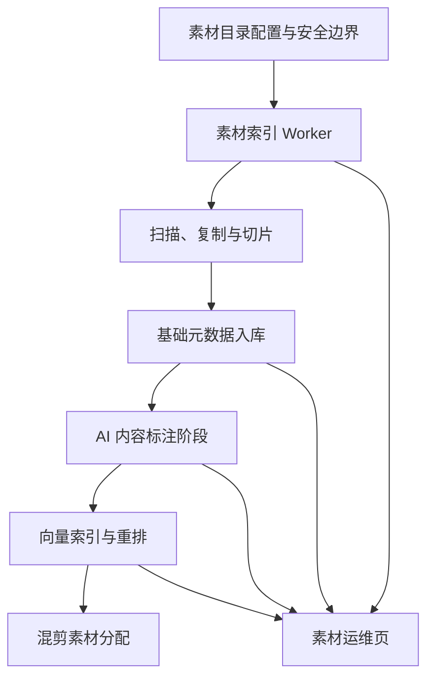
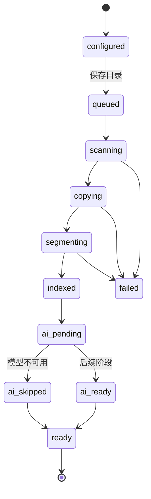

# AutoVideo 本地素材库与素材 Worker 设计

日期：2026-06-24

## 背景

AutoVideo 当前已有 `POST /api/materials` 和 `GET /api/materials`，并且线上混剪工作台可以用 `material_id` 为单个镜头选择已有本地素材。但当前“素材库”一级导航仍禁用，前端没有独立素材管理页，后端也没有按目录扫描、切片、内容标注和素材匹配的长期索引链路。

用户确认本次方向参考 `junxincode` 项目的本地视频素材处理方式，但不做上传式素材库。新的素材库应允许用户指定服务端可访问的本地目录；AutoVideo 复制该目录中的素材到自己的数据目录，按 junxincode 风格完成扫描、切片、索引、AI 内容标注、向量检索和混剪前素材分配。

用户已确认以下关键边界：

1. 指定本地目录后，素材先复制/切片到 AutoVideo 数据目录，再被任务引用，不长期依赖外部目录原文件。
2. 目标方案采用完整 junxincode 风格的 worker、任务队列、模型处理、向量检索、素材运维和混剪分配架构。
3. 模型处理使用 AutoVideo 内置本地处理能力，不调用 junxincode 的 local-ai 服务。
4. 资源策略采用混合模式：基础扫描和切片必跑，ASR、OCR、Qwen-VL、Embedding、Reranker 按本机能力自动启用；不可用时降级。
5. 本地目录安全边界采用允许根目录白名单：环境变量配置允许访问的根目录，前端只能选择或填写这些根目录下的子目录。
6. 索引触发采用组合模式：保存目录后后台预处理；开始混剪时检查缺口并补处理，未完成能力按降级策略继续。

## 目标

1. 启用“素材库”一级入口，提供本地素材目录配置、索引状态、素材统计、文件列表、错误摘要和危险操作。
2. 通过 `AUTOVIDEO_MATERIAL_ALLOWED_ROOTS` 配置允许访问的本地根目录，后端拒绝越界路径。
3. 新增素材 worker 与任务状态表，支持后台扫描、复制、切片和基础索引。
4. 使用 FFmpeg/ffprobe 提取视频时长、方向、大小、切片等基础元数据。
5. 为 ASR、OCR、Qwen-VL、Embedding 和 Reranker 预留完整 stage、状态字段和后续接线点。
6. 混剪任务优先使用 ready 本地切片；AI/向量可用时优先走向量和重排，不可用或未就绪时降级到基础匹配。
7. 删除或清空 AutoVideo 素材库时只清理 AutoVideo 数据目录和索引，不删除外部原始目录。
8. 前端桌面端和移动端都可读、可点、可滚动，不依赖 hover。
9. README 和帮助文档同步说明本地目录配置、处理流程、安全边界、降级语义和不会删除外部目录。

## 非目标

1. 第一阶段不实现上传式素材管理；现有上传 API 保留兼容，但新素材库页面不以上传为主入口。
2. 第一阶段不下载或提交模型权重，不把任何本机模型路径、token、`.env` 实际值或素材绝对路径样本写入仓库。
3. 第一阶段不完整实现 ASR、OCR、Qwen-VL、Embedding、Reranker 的模型运行，只预留任务阶段、状态和接口边界。
4. 第一阶段不实现多用户权限、团队空间、远程网盘导入、SMB、公盘扫描或 junxincode 的内网 token 体系。
5. 第一阶段不引入独立外部队列服务；可先使用进程内后台任务和锁，接口保留 job id 以便后续拆 worker 进程。
6. 不把删除目录配置等同于删除素材文件，避免破坏历史任务引用。

## 方案选择

### 方案 1：轻量目录素材库

只做目录扫描、复制、切片、方向/时长索引和基础匹配。交付快且稳定，但不满足用户选择的 ASR、OCR、Qwen-VL、向量检索和重排目标。

不采用。

### 方案 2：分层本地素材处理系统

基础处理必跑，AI 能力作为同一 worker 的可选阶段逐步启用。范围可控，也能接近 junxincode 的处理方式。

不作为最终目标采用，但第一阶段会复用这种分层交付方式。

### 方案 3：完整 junxincode 风格素材 worker

实现独立素材 worker、任务队列、模型处理、向量索引、素材运维页和混剪分配。能力最完整，但不能压成一个单页改动或单个巨型 PR。

采用。落地方式是“完整目标架构 + 第一阶段可运行骨架”：第一阶段完成目录白名单、素材 worker、队列、扫描、复制、切片、SQLite 状态表、运维页展示和基础匹配；AI 标注、向量检索和 Reranker 作为同一架构的后续阶段接入。

## 总体架构



第一阶段可运行链路：


## 后端模块

后端按职责拆分，不把素材 worker 逻辑塞进现有 `materials.py` 或 `online_mix.py`。

1. `autovideo/services/material_sources.py`
   - 解析 `AUTOVIDEO_MATERIAL_ALLOWED_ROOTS`。
   - 校验用户提交目录是否存在、可读、经 `resolve(strict=True)` 后仍在允许根目录内。
   - 保存当前启用目录配置。
   - 返回可选根目录、当前目录、配置状态和错误摘要。
2. `autovideo/services/material_worker.py`
   - 创建索引 job。
   - 以 SQLite job 表作为持久队列源，管理同目录运行锁，避免重复索引。
   - claim 可执行 job、写入 heartbeat、识别 stale job，服务重启后可恢复或重试未完成任务。
   - 调度扫描、复制、切片、基础入库和预留 AI stage。
   - 更新 job 进度、阶段、错误摘要。
3. `autovideo/services/material_processing.py`
   - 递归扫描支持的视频文件，默认不跟随 symlink 目录；文件 symlink 必须 resolve 后仍在允许根目录内。
   - 根据内容 hash 或 source path hash 去重。
   - 复制原始文件到 `data/materials/raw`。
   - 调用 ffprobe 获取时长、方向、编码等基础信息。
   - 调用 FFmpeg 按固定时长切片到 `data/materials/segments`。
   - 记录单文件失败，不因一个坏文件中断整批目录。
4. `autovideo/services/material_matcher.py`
   - 混剪前查询 ready segments。
   - 基础匹配按画幅/方向、时长、关键词、文件名、目录名排序。
   - 后续 AI/向量启用后，内部优先走 embedding/rerank，再 fallback 到基础匹配，不改变调用方。
5. `autovideo/api/routes/material_sources.py`
   - 暴露目录根、当前目录、保存目录、刷新索引等接口。
6. `autovideo/api/routes/material_index.py`
   - 暴露 job 状态、素材统计、raw 文件列表、segment 明细、删除和清空接口。
7. `autovideo/api/routes/materials.py`
   - 保留现有上传/列表兼容接口。
   - 新目录索引能力不放进现有 `/api/materials` 的旧语义里，避免接口职责混乱。

## 安全不变量

路径安全是本功能的硬边界，后续实现不能只做字符串前缀判断。

1. 启动时解析 `AUTOVIDEO_MATERIAL_ALLOWED_ROOTS`，每个 root 必须 `resolve(strict=True)`；不存在或不可读的 root 不进入可选列表。
2. 前端提交的目录必须先和对应 allowed root 拼接，再 `resolve(strict=True)`；解析后的目录必须能 `relative_to(allowed_root_resolved)`，否则返回 `MATERIAL_SOURCE_PATH_OUT_OF_SCOPE`。
3. 递归扫描默认不跟随 symlink 目录。对普通文件和文件 symlink，复制前必须对最终路径 `resolve(strict=True)`，并再次确认仍在 allowed root 内。
4. 拒绝 `..`、空路径、绝对路径伪装、NUL 字符和平台分隔符混淆导致的路径逃逸；所有路径校验以 resolved `Path` 对象为准。
5. API 响应、前端状态、manifest 和错误消息不得返回外部目录绝对路径、managed data 绝对路径、模型路径、token 或 `.env` 实际值。
6. 数据库中可保存用于内部查找的 root id、相对路径、hash 和 managed 相对路径；公开 DTO 只返回 alias、display path、文件名或 hash 摘要。
7. 外部素材目录在 AutoVideo 视角下只读；扫描、复制、索引、删除、清空都不得修改或删除外部目录原文件。
8. 删除 raw/segment 文件前必须从 managed root 和数据库中的 managed 相对路径重建路径，`resolve()` 后确认在 `AUTOVIDEO_DATA_DIR/materials` 下。越界、空路径、绝对路径或记录损坏时返回结构化错误，不删除文件，也不把记录标记为 deleted。
9. 清空素材库只遍历 AutoVideo 自己创建的 managed raw/segments root，不信任数据库里的任意绝对路径。

## API 契约

第一阶段新增 API 使用 `/api/material-sources` 和 `/api/material-index` 前缀，避免和旧上传式 `/api/materials` 混淆。

| Method | Path | Request | Response | Notes |
| --- | --- | --- | --- | --- |
| `GET` | `/api/material-sources` | 无 | `{ allowed_roots, current_source, latest_job }` | `allowed_roots` 只返回 `id`、`alias`、`display_name` 和可选 `description`，不返回 root 绝对路径。 |
| `PUT` | `/api/material-sources/current` | `{ allowed_root_id, source_relative_path }` | `{ current_source, job }` | 保存目录并创建或复用索引 job；`source_relative_path` 必须是 root 下相对路径。 |
| `POST` | `/api/material-index/jobs` | `{ source_config_id?, force?: boolean }` | `{ job_id, status }` | 手动刷新索引；`force` 只允许重建已完成、失败或 stale 的索引，不能绕过同目录 queued/running active job 保护；active job 存在时仍返回 `MATERIAL_INDEX_ALREADY_RUNNING`。 |
| `GET` | `/api/material-index/jobs/{job_id}` | 无 | `{ id, status, stage, progress, counts, error_summary }` | 不返回绝对路径。 |
| `GET` | `/api/material-index/summary` | `limit? offset?` query | `{ totals, current_source, latest_job }` | totals 包含 raw、segment、portrait、landscape、failed、AI stage 状态。 |
| `GET` | `/api/material-index/raw-files` | `limit? offset? status?` query | `{ items, limit, offset, total }` | item 只返回 `id`、`filename`、`source_display_path`、size、duration、orientation、segments、status、error。 |
| `GET` | `/api/material-index/raw-files/{raw_file_id}/segments` | `limit? offset?` query | `{ items, limit, offset, total }` | segment 不返回 `segment_path`。 |
| `DELETE` | `/api/material-index/raw-files/{raw_file_id}` | 无 | `{ id, deleted: true }` | 只删除 managed raw/segments 文件，失败时不软删记录。 |
| `POST` | `/api/material-index/library/clear` | `{ confirm: \"CLEAR_MATERIAL_LIBRARY\" }` | `{ deleted_raw, deleted_segments }` | 危险操作，需要确认字段；只清理 managed root，缺少确认字段时必须拒绝。 |

前端 `frontend/src/api/materials.ts` 的函数必须一一对应这些 HTTP 契约。路径类字段统一使用 `source_display_path`、`allowed_root_alias`、`raw_file_id`、`segment_id` 这类安全字段，不使用或展示绝对路径。

## 数据模型

第一阶段继续使用 SQLite，和现有 `AutoVideoStore` 保持同库管理。新增表要使用 `_ensure_schema` 中的向后兼容迁移方式。

### `material_source_configs`

保存当前素材目录配置。

字段：

1. `id TEXT PRIMARY KEY`
2. `allowed_root_id TEXT NOT NULL`
3. `allowed_root_alias TEXT NOT NULL`
4. `source_relative_path TEXT NOT NULL`
5. `source_display_path TEXT NOT NULL`
6. `source_path_hash TEXT NOT NULL`
7. `status TEXT NOT NULL`
8. `error_summary TEXT`
9. `created_at TEXT NOT NULL`
10. `updated_at TEXT NOT NULL`

### `material_index_jobs`

记录每次索引任务状态。

字段：

1. `id TEXT PRIMARY KEY`
2. `source_config_id TEXT NOT NULL`
3. `allowed_root_id TEXT NOT NULL`
4. `source_relative_path TEXT NOT NULL`
5. `source_path_hash TEXT NOT NULL`
6. `status TEXT NOT NULL`
7. `stage TEXT NOT NULL`
8. `progress_current INTEGER NOT NULL DEFAULT 0`
9. `progress_total INTEGER NOT NULL DEFAULT 0`
10. `raw_files_total INTEGER NOT NULL DEFAULT 0`
11. `segments_total INTEGER NOT NULL DEFAULT 0`
12. `failed_total INTEGER NOT NULL DEFAULT 0`
13. `heartbeat_at TEXT`
14. `attempt_count INTEGER NOT NULL DEFAULT 0`
15. `error_summary TEXT`
16. `created_at TEXT NOT NULL`
17. `started_at TEXT`
18. `finished_at TEXT`

active job 唯一约束基于标准化目录身份，例如 `status IN ('queued', 'running')` 时 `(allowed_root_id, source_path_hash)` 唯一，或等价使用 `(allowed_root_id, normalized source_relative_path)`。`source_config_id` 只作为 job 与目录配置记录的关联字段，不能作为 active job lock 的唯一依据。

### `material_raw_files`

记录复制到 AutoVideo 数据目录的原始文件。

字段：

1. `id TEXT PRIMARY KEY`
2. `source_config_id TEXT`
3. `allowed_root_id TEXT NOT NULL`
4. `source_relative_path TEXT NOT NULL`
5. `source_path_hash TEXT NOT NULL`
6. `source_display_path TEXT NOT NULL`
7. `original_filename TEXT NOT NULL`
8. `managed_raw_relative_path TEXT NOT NULL`
9. `content_hash TEXT`
10. `size_bytes INTEGER NOT NULL`
11. `duration_seconds REAL`
12. `orientation TEXT`
13. `status TEXT NOT NULL`
14. `error_summary TEXT`
15. `asr_status TEXT NOT NULL DEFAULT 'not_configured'`
16. `ocr_status TEXT NOT NULL DEFAULT 'not_configured'`
17. `vision_status TEXT NOT NULL DEFAULT 'not_configured'`
18. `embedding_status TEXT NOT NULL DEFAULT 'not_configured'`
19. `created_at TEXT NOT NULL`
20. `updated_at TEXT NOT NULL`
21. `deleted_at TEXT`

`source_display_path` 只保存相对于允许根目录的可读摘要，不保存可从 API 暴露的完整绝对路径。内部如需重新定位源文件，只从当前 env root 与 `source_relative_path` 重建，并重新执行安全不变量中的 resolve 校验。`managed_raw_relative_path` 必须是相对 `data/materials/raw` 的受控路径，不能是绝对路径。

### `material_segments`

记录可用于混剪的切片。

字段：

1. `id TEXT PRIMARY KEY`
2. `raw_file_id TEXT NOT NULL`
3. `managed_segment_relative_path TEXT NOT NULL`
4. `start_seconds REAL NOT NULL`
5. `duration_seconds REAL NOT NULL`
6. `orientation TEXT`
7. `status TEXT NOT NULL`
8. `match_text TEXT`
9. `asr_text TEXT`
10. `ocr_text TEXT`
11. `vision_description TEXT`
12. `content_label_status TEXT NOT NULL DEFAULT 'not_configured'`
13. `embedding_status TEXT NOT NULL DEFAULT 'not_configured'`
14. `error_summary TEXT`
15. `created_at TEXT NOT NULL`
16. `updated_at TEXT NOT NULL`
17. `deleted_at TEXT`

第一阶段 `asr_text`、`ocr_text`、`vision_description` 保持空，相关状态写 `not_configured` 或 `skipped`。后续阶段补模型处理时不需要改表结构。`managed_segment_relative_path` 必须是相对 `data/materials/segments` 的受控路径，不能是绝对路径。

## 任务状态与降级

索引任务状态：



第一阶段 job 的持久状态与处理阶段分开保存：

1. `status`：`queued`、`running`、`succeeded`、`failed`、`stale`、`canceled`。
2. `stage`：`scanning`、`copying`、`segmenting`、`indexed`、`ai_skipped`、`ready` 等用户可见阶段。

第一阶段实现 `queued`、`running`、`succeeded`、`failed`、`stale`，以及 `scanning`、`copying`、`segmenting`、`indexed`、`ai_skipped`、`ready` 阶段。`canceled`、`ai_pending` 和 `ai_ready` 作为后续阶段状态保留。

SQLite job 表是第一阶段的持久队列源，不引入外部队列服务，但不能只依赖内存状态：

1. 创建 job 时写入 `queued`。
2. worker claim job 时在同一事务中把 `queued` 改为 `running`，递增 `attempt_count`，写入 `started_at` 和 `heartbeat_at`。
3. worker 处理长任务时定期更新 `heartbeat_at`、`stage` 和 progress。
4. 服务启动时扫描 `running` 且 heartbeat 超时的 job，标记为 `stale`，再按配置决定自动重试或等待用户手动刷新。
5. 同一标准化目录身份同时只能有一个 `queued` 或 `running` job；目录身份以 `(allowed_root_id, source_path_hash)` 为准，或等价使用 `(allowed_root_id, normalized source_relative_path)`。违反时返回 `MATERIAL_INDEX_ALREADY_RUNNING`，`source_config_id` 只用于关联配置记录，不作为 active job lock 的唯一依据。
6. 单进程部署可用进程内锁减少重复 claim；多进程或未来独立 worker 必须以 SQLite 事务和唯一 active job 约束为准。
7. `stale`、`failed`、`succeeded` 都是终态；重试必须创建新 job，不能原地复活旧 job。

降级策略：

1. FFmpeg 不可用时，目录可保存但索引 job 进入失败，错误码为 `MATERIAL_FFMPEG_UNAVAILABLE`。
2. 单个视频无法 probe 或切片时，raw file 记录 `failed`，job 继续处理剩余文件。
3. AI 模型不可用时，AI stage 写 `not_configured` 或 `skipped`，基础索引仍可 ready。
4. 向量不可用时，matcher 不报错，自动降级到基础匹配。
5. 基础 ready segment 为空时，混剪返回 `MATERIAL_LIBRARY_EMPTY` 或沿用线上素材 fallback，具体由素材源模式决定。

## 混剪接线

混剪工作台新增素材来源模式：

1. `local`：只使用本地素材库。
2. `hybrid`：本地优先，缺口用线上免费素材补足。
3. `online_free`：只使用线上免费素材。

后端创建线上混剪任务前调用 `material_matcher.prepare_for_script(...)`：

1. 检查当前素材目录和最近 ready job。
2. 如果没有 ready segment，触发或复用一个索引 job，并返回明确错误或等待状态。
3. 如果有部分 ready segment，按模式决定是否继续：
   - `local`：缺口返回 `MATERIAL_LIBRARY_EMPTY` 或 `ONLINE_MIX_NO_MATERIAL_MATCH`。
   - `hybrid`：本地缺口进入现有线上素材搜索与下载流程。
   - `online_free`：不调用本地 matcher。
4. matcher 选出的 segment 必须接入现有 `materials`/`material_id` 契约，避免 renderer 和 task 形成双轨素材模型。
5. 第一阶段采用持久 `materials` 兼容记录：每个 ready segment 生成或复用一条 `materials` 表记录，`source_type='local_segment'`，`source_provider='local_material_worker'`，`source_asset_id=segment_id`，`storage_path` 指向 managed segment 文件。公开 API 仍不返回 `storage_path`。
6. `shot_materials` 继续传 `material_id` 给现有渲染链路；manifest 额外记录 `material_segment_id`、`raw_file_id`、`selection_mode`、`selection_reason`、`orientation`、`duration_seconds`。
7. `source_attribution` 使用文件名、source display path 和 worker 来源摘要，不暴露外部 source 绝对路径或 managed path。
8. 删除或清空素材库时，对应 `local_segment` materials 记录要软失效或删除；历史任务 manifest 已保存快照，但再次下载历史输出不得依赖已删除素材。
9. 对外响应继续不暴露 `managed_segment_relative_path`、`managed_raw_relative_path`、`storage_path` 或外部 source 绝对路径。

## 文件布局与清理

数据目录：

```text
data/
  materials/
    raw/
      <raw-file-id>.<ext>
    segments/
      <raw-file-id>/
        <segment-id>.mp4
```

清理语义：

1. 删除目录配置只停止后续自动使用，不立即删除已索引素材。
2. 删除单个原始素材会删除 AutoVideo 数据目录中的复制文件和切片，并软删除数据库记录。
3. 清空素材库会删除 `data/materials/raw`、`data/materials/segments` 下的 AutoVideo 管理文件，并软删除索引记录。
4. 所有删除动作不得删除外部原始目录中的文件。
5. 删除前必须用 managed root 和相对路径重建待删除文件，`resolve()` 后确认仍在 managed root 内；如果记录是绝对路径、空路径、越界路径或路径解析异常，返回 `MATERIAL_LIBRARY_CLEAR_FAILED` 或文件级错误，不执行删除。
6. 如果文件删除失败，数据库记录不得标记为完全删除，应返回 `MATERIAL_LIBRARY_CLEAR_FAILED` 或文件级错误摘要。

## 前端设计

新增 `frontend/src/api/materials.ts`，与旧 `onlineRemix.ts` 中的 `fetchMaterials` 解耦。API 包含：

1. `fetchMaterialSourceStatus()`
2. `saveMaterialSource(input)`
3. `startMaterialIndex(input)`
4. `fetchMaterialIndexJob(jobId)`
5. `fetchMaterialLibrarySummary()`
6. `fetchMaterialRawFiles()`
7. `deleteMaterialRawFile(rawFileId)`
8. `clearMaterialLibrary()`
9. `readableMaterialError(error)`

新增 `frontend/src/components/MaterialLibraryWorkbench.tsx`。

桌面端结构：

1. 目录配置区：允许根目录下拉、子目录输入、保存按钮、刷新索引按钮。
2. 索引状态区：当前 job、阶段、进度、最近处理时间、错误摘要。
3. 素材统计区：原始视频、切片总数、横屏、竖屏、失败数、AI 标注状态。
4. 原始文件列表：文件名、大小、时长、方向、切片数、状态、错误摘要、操作。
5. 切片或错误明细：默认折叠，避免第一屏过密。
6. 危险操作区：清空素材库，二次确认。

移动端结构：

1. 继续使用现有横向滚动一级 tabs，素材库入口保持可见且触控区不低于 44px。
2. 页面单列排列：目录配置、状态统计、原始素材列表、危险操作。
3. 统计块使用 2 列换行或横向滚动，不把所有指标硬挤到一行。
4. 原始素材列表使用可展开行，默认显示文件名、状态、方向和切片数；展开后显示错误、路径摘要和操作。
5. 不依赖 hover；展开、删除确认和刷新都要支持键盘操作。

UI 约束：

1. 所有输入有可见 label。
2. 错误显示在对应字段或操作附近。
3. 加载超过 300ms 显示状态，后台任务使用 `aria-live`。
4. 按钮使用 lucide 图标和中文标签，不使用 emoji 作为结构图标。
5. 不在页面内写长篇功能说明，只显示当前状态和可执行动作。
6. 可展开行使用 `aria-expanded`，删除确认关闭后焦点返回触发按钮。
7. 清空素材库确认必须可键盘操作，不依赖浏览器默认 `confirm` 才满足最终验收；如果第一阶段先用 `window.confirm`，实现计划必须包含后续替换为可访问确认弹窗的任务。
8. 长文件名、目录摘要和错误文案必须换行或截断加 title/tooltip，不允许撑出移动端视口。

## 错误码

核心结构化错误码：

1. `MATERIAL_SOURCE_ROOT_NOT_CONFIGURED`：未配置允许根目录。
2. `MATERIAL_SOURCE_PATH_OUT_OF_SCOPE`：目录不在允许根目录内。
3. `MATERIAL_SOURCE_NOT_FOUND`：目录不存在或不可读。
4. `MATERIAL_INDEX_JOB_NOT_FOUND`：索引任务不存在。
5. `MATERIAL_INDEX_ALREADY_RUNNING`：同一目录已有索引任务运行。
6. `MATERIAL_SCAN_NO_SUPPORTED_FILES`：目录里没有支持的视频文件。
7. `MATERIAL_FFMPEG_UNAVAILABLE`：FFmpeg 不可用，无法切片。
8. `MATERIAL_SEGMENT_FAILED`：单个文件切片失败，写文件级错误，不中断整批。
9. `MATERIAL_LIBRARY_EMPTY`：混剪时没有 ready 切片可用。
10. `MATERIAL_LIBRARY_CLEAR_FAILED`：清空 AutoVideo 素材缓存失败。
11. `MATERIAL_RAW_FILE_NOT_FOUND`：要删除的原始素材不存在或已删除。

错误响应不得包含内部绝对路径、token、模型路径或外部目录完整路径。

## 测试计划

后端 API 测试：

1. 未配置允许根目录时返回 `MATERIAL_SOURCE_ROOT_NOT_CONFIGURED`。
2. 越界路径返回 `MATERIAL_SOURCE_PATH_OUT_OF_SCOPE`。
3. 不存在或不可读目录返回 `MATERIAL_SOURCE_NOT_FOUND`。
4. 保存目录会创建 index job。
5. 查询 job 状态、素材统计、raw 文件列表成功。
6. 清空素材库只删除 AutoVideo 数据目录，不删除外部源目录。
7. API 响应不包含 allowed root 绝对路径、source 绝对路径、managed path 或 `storage_path`。
8. 分页参数 `limit`、`offset` 生效且有上限。

Service 测试：

1. 递归扫描只接受支持的视频扩展名。
2. 重复文件去重，不重复创建 raw/segments。
3. 文件复制目标始终在 `AUTOVIDEO_DATA_DIR/materials/raw`。
4. 单文件 probe 或切片失败会记录错误并继续处理。
5. `source_display_path` 不包含完整绝对路径。
6. allowed root、提交目录、扫描文件都使用 resolved path 做 containment 校验。
7. symlink 目录默认不跟随；文件 symlink 指向 root 外时拒绝。
8. 清理 corrupted managed path 时不会删除 managed root 外文件，也不会软删记录。
9. 服务重启后 stale running job 会被标记为 `stale`，新刷新会创建新 job。

Processing 测试：

1. ffprobe 命令构造正确。
2. FFmpeg 切片命令构造正确。
3. FFmpeg 不可用时 job 失败且返回结构化错误。
4. 空目录返回 `MATERIAL_SCAN_NO_SUPPORTED_FILES`。

Matcher 测试：

1. 按画幅/方向过滤切片。
2. 按时长满足镜头需求。
3. 关键词、文件名、目录名参与基础排序。
4. 无 ready segment 时返回 `MATERIAL_LIBRARY_EMPTY`。
5. `hybrid` 模式允许本地缺口交给线上素材 fallback。
6. ready segment 会生成或复用 `materials` 兼容记录，混剪仍通过 `material_id` 消费素材。
7. manifest 同时保留 `material_id` 和 `material_segment_id`，且不泄漏路径。

前端测试：

1. 素材库导航启用，`#materials` 能打开页面并更新标题。
2. 目录配置表单展示允许根目录、保存按钮和错误状态。
3. 索引状态、空态、失败态、统计卡片渲染正确。
4. 删除单素材和清空素材库需要确认。
5. 375px 移动端 tabs 不挤压，页面无横向溢出，关键按钮可点可读。
6. 删除确认有明确焦点管理，关闭后焦点回到触发按钮。
7. 可展开素材行有 `aria-expanded`，键盘可展开和收起。
8. 后台任务状态通过 `aria-live` 通知，且不会抢焦点。
9. 44px 触控区和长文件名换行在移动端断言中覆盖。

文档测试：

1. README 包含 `AUTOVIDEO_MATERIAL_ALLOWED_ROOTS`。
2. `.env.example` 包含 `AUTOVIDEO_MATERIAL_ALLOWED_ROOTS` 的安全占位示例，示例不得使用真实本机路径、token 或内网地址。
3. README 明确不会删除外部目录文件。
4. 当前 AutoVideo 没有独立帮助中心或内置帮助页，本轮帮助面以 `README.md` 和 `.env.example` 为准。
5. 如果实现阶段新增应用内帮助入口，必须同步说明素材库入口、目录配置、索引状态和混剪素材源模式。

## 验收标准

1. `.env` 配置允许根目录后，前端能保存其子目录并触发后台索引。
2. 素材库页能显示 raw/segments 统计、横竖屏统计、失败摘要和当前 job 阶段。
3. 目录中的视频被复制到 `AUTOVIDEO_DATA_DIR`，外部原文件不被修改。
4. FFmpeg 可用时能生成切片；不可用时给清晰结构化错误。
5. 混剪任务能使用 ready 本地切片；无本地素材时不生成伪成功。
6. 本地素材匹配不向前端、manifest 或 API 响应泄漏本机绝对路径。
7. 375px 移动端没有横向页面溢出，关键操作可点可读。
8. symlink、路径穿越、corrupted DB path 和清空素材库场景都不能逃出 allowed root 或 managed root。
9. 不提交 token、模型权重、`.env` 实际值、本地素材路径样本或内网地址。

## 后续阶段

第二阶段：把 ASR、OCR、Qwen-VL 内容描述作为 worker stage 接入。模型不可用时继续写 `not_configured`，可用时写入 `asr_text`、`ocr_text`、`vision_description` 和内容标签状态。

第三阶段：接入本地 embedding 和 reranker，新增向量索引存储或本地向量库适配层，matcher 优先使用向量召回和重排。

第四阶段：如果进程内 worker 不足以承载长任务，拆出独立 worker 进程和持久任务队列。FastAPI 仅负责入队、查询状态和混剪前准备。

第五阶段：扩展素材运维页，支持内容标签回填、向量回填、暂停/恢复/取消、失败重试和索引健康诊断。
